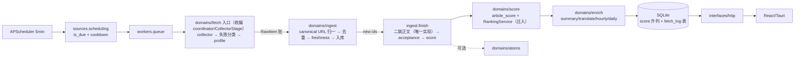

# PIM 专家代码审阅报告

**日期：** 2026-07-02
**对应需求：** `2026-07-02-pim-expert-review-brief.md`
**审阅对象：** personal-info-monitor（commit `1c2fce6`，v1.3.1）
**审阅方式：** 全量静态代码审阅 + 关键疑点最小可运行实验验证。动态抓取实测受审阅环境限制未执行（后端 venv 为 macOS 二进制、运行数据库位于 `~/.pim` 未随仓库提供），已在 §5.4 给出可直接执行的实测方案与评估表模板。

---

## 1. 执行摘要

**核心结论：PIM 目前"基本能"聚合最新信息，但可靠性建立在 RSS 路径上；纯网站（无 feed）路径可用但脆弱，且存在几类会让用户"以为在正常工作、实际漏抓/浪费"的静默问题。** 具体判断：

- **RSS / Podcast 源：可靠。** feed 字段解析、时区处理（`timegm`）、健康分级（ok/stale/empty/parse_error）都做得规范。但每轮抓取对每条 entry 都做**去重前**的正文二跳（见 P1-1），成本与封禁风险显著；且纯文本 <100 字的 entry 被 collector 直接丢弃（P1-3），与"RSS 仅摘要也可打分"的设计自相矛盾。
- **网站源：只填首页 URL 时能发现文章，但质量不稳。** 通用 CSS 选择器 + 兜底 anchor 扫描能从首页/栏目页提取最多 20 条候选并对前 8 条做正文二跳；发布时间经常拿不到（靠逐篇二次请求兜底），首页噪声靠一套硬编码启发式过滤。`discovery` 规则设计良好但**必须手工配置**，且与默认路径能力重叠。
- **X 源：策略回退链完整，但全部失败时表现为"成功且无新内容"**，error_count 被清零、无冷却、无告警（P1-2）。Nitter 公共实例与 rsshub.app 在 2026 年的实际可用性堪忧，需要实测确认。
- **YouTube：仅标题+描述**（yt-dlp flat 模式），无字幕/transcript，视频内容对评分和聚类基本是"标题党输入"。
- **调度/失败闭环：设计真实生效。** cooldown → `next_fetch_at_for` → 调度跳过的链路确认贯通；429/403/bot_wall 有升级冷却；error backoff 2^n 封顶 32×；错误 12 次自动禁用。这部分是系统的亮点。
- **架构：文档与运行时不符。** 文档宣称的 fetch 域入口 `orchestrator.fetch_source_batch` 是**零调用方的死代码**，真实主链仍是 legacy `pipeline/coordinator + CollectorStage`（P2-6）。同时存在一批"写了没人读"的模块与字段（session_health 整个模块、feed 发现缓存、profile 的 preferred_strategy 与正文完整率）。
- **算法：规则化程度高但边界清晰**，去重覆盖单源场景尚可，跨源/跨协议重复基本没有防御；事件聚类（Jaccard 贪心）与 corroboration（source_id 计数）对通稿/多栏目会高估多源佐证——文档已自知。缺少任何用户反馈闭环。

**最高优先级三件事**（详见 §9、§11）：

1. 把"抓取失败被吞成 no_new_content"的静默失败修掉（X/YouTube/静态网站三处 collector 吞异常返回 `[]`）。
2. RSS 二跳 hydration 移到去重之后（或复用 finish 阶段已有的 `article_body` 二跳），消除每轮最多 20 次/feed 的重复全文请求。
3. 补齐 URL 归一化（utm/query、http↔https、≥5 位数字段误合并），这是去重与"重复条目出现在 Dashboard"问题的根。

---

## 2. 架构审阅

### 2.1 分层与阶段划分：合理，方向正确

`sources → fetch → ingest → score → [atoms] → enrich` 的七阶段划分与 `interfaces / domains / platform` 三层对本地单体是合适的。值得肯定并**建议保留**的设计：

- `domains/fetch/failures.py` 的失败分类税收表（纯函数、含 retryable/severity/cooldown 策略表）+ `retry_policy.py` 熔断记录 + `sources/scheduling.py` 消费 `cooldown_until` —— 三段式闭环真实生效，是整个抓取域最扎实的部分。
- `ingest/finish.py` 作为 ingest→summarize→score→atoms→notify 的唯一汇合点，阶段顺序清晰，LLM 只出现在 4–5 阶段。
- `acceptance.py` 把"抓取完整性验收"与"价值评分"分离（`fetch_acceptance=incomplete` 不打分），概念正确。
- atoms 作为默认关闭、永不阻塞主链的旁路（`atomize_content_async` 内部检查 `atoms_enabled()`），边界干净。
- 调度公式集中在 `sources/scheduling.py` 单点（UI 与调度器共用 `next_fetch_at_for`），确定性 jitter 设计考究。
- 依赖方向由 `scripts/check_domain_imports.py` 在 CI 静态强制。

### 2.2 名义架构 vs 实际链路：主链没有搬进 fetch 域

实际运行链路是：

```
APScheduler(5min) → check_and_fetch_due_sources (tasks/fetch_tasks.py:182)
  → task_queue.enqueue_fetch → fetch_source → _do_fetch (fetch_tasks.py:52)
    → run_fetch_pipeline (app/pipeline/coordinator.py:166)   ← legacy 层
      → CollectorStage.execute (app/pipeline/collector_stage.py:52)
        → domains/fetch/collectors/*.fetch()
      → NormalizerStage (domains/ingest/normalizer.py)
      → build_raw_content_objects + StorageStage
  → task_queue.enqueue_ingest_finish → finish_content (domains/ingest/finish.py)
```

而文档（ARCHITECTURE.md §4、审阅需求 §4.2）声称的 fetch 域入口 `domains/fetch/orchestrator.py::fetch_source_batch` **在整个代码库中没有任何生产调用方**（仅 `domains/fetch/__init__.py` re-export）。它自述是"Phase 2 的 thin adapter，后续 step 3+ 会反转依赖"——反转从未发生。后果：

- 新人（和外部审阅者）按文档看 orchestrator，实际逻辑在 `pipeline/`；
- `FetchBatch/RawItem` contract DTO 层白白维护；
- 需求文档里的 `fetch_source_async` 根本不存在（实际叫 `fetch_source`）。

**建议：** 二选一，要么完成反转（把 coordinator/CollectorStage 逻辑迁入 fetch 域、pipeline 变 shim），要么删除 orchestrator + contracts 的 fetch 部分并改文档。半途状态是最贵的。

### 2.3 services 层归属

- `ranking_service.py`、`digest_service.py`：纯业务逻辑，且被 `domains/enrich/hourly` 反向依赖（`hourly/selection.py:20` import `app.services.ranking_service`）——**domains 依赖 services**，与"新增代码走 canonical 路径"的规则相悖。RankingService 应迁入 `domains/score`（它本质是 score_event 的消费端），digest_service 迁入 `domains/enrich`。
- `probe_service.py` + `probe_strategies/`：可留在 services（探测是 sources 域的用例编排），但更一致的做法是归入 `domains/sources`。
- `scoring_service.py`、`content_quality_service.py` 已是纯 re-export facade，可按 Phase 7 的口径排期删除。

### 2.4 shim 现状

`app/collectors`、`app/processors`、`app/tasks/task_queue`、`app/pipeline/utils`、`app/services/scoring_service` 等 shim 仍在，且**不只是 patch-target**：`article_body.py:167` 生产代码经 `importlib.import_module("app.collectors.x_twitter")` 走旧路径，`finish.py` import `app.processors.content_processor/keyword_matcher`。shim 数量本身可控，但"生产代码仍在消费 shim"说明 Phase 7 收尾未做完，测试 patch 目标与真实调用点漂移的风险是真实的（同一个类可能从两个路径 patch 不一致）。

### 2.5 SQLite + JSON metadata

对单用户本地系统，SQLite + `metadata_` JSON 承载画像/失败/质量信息**总体仍然合适**（FTS5、`json_extract` 排序都在用），但有三个具体痛点：

1. `fetch_profile` 的日桶写入让**每次抓取都重写整个 Source.metadata_ JSON**，与 probe、discovery_diagnostics、rss_health、fetch_failure 混在同一个 blob 里，并发写覆盖风险集中（coordinator 与 collector 都会 `source.metadata_ = {...}`）。
2. `contents.metadata_` 上的 `final_score/selection_status` 只能靠 `json_extract` 查询，hourly 候选查询已经在用表达式索引不了的 coalesce 排序（`hourly/repository.py:44`）。
3. 无法对失败码/评分做高效聚合分析。

**建议（中期）：** 把三个高频读写字段升表列或独立表：`contents.article_score`、`contents.selection_status`、`source_fetch_log`（append-only 抓取流水，替代 fetch_profile 日桶）。其余 JSON 保留。

### 2.6 复杂度评估

对"本地优先单体"而言，当前拆分**略过度**：fetch 域 30+ 文件、atoms 域 20+ 文件（默认关闭）、6 个 dead/半 dead 模块（§3.4）。但边界本身不乱，问题是"迁移未收尾 + 死代码未清"，不是"拆得不对"。**不建议再做大重构**，建议做减法。

### 2.7 架构问题分级清单

| 级别 | 问题 | 位置 |
|---|---|---|
| P1 | 文档宣称的 fetch 入口是死代码，真实主链在 legacy pipeline | `domains/fetch/orchestrator.py`（全文件） |
| P1 | domains/enrich 反向依赖 app/services（ranking_service） | `domains/enrich/hourly/selection.py:20`、`hourly/tasks.py:50` |
| P2 | 生产代码仍消费历史 shim（app.collectors / app.processors） | `domains/fetch/article_body.py:167`、`domains/ingest/finish.py:44-50` |
| P2 | 二跳正文能力三处重复实现（RSS collector 逐条 hydrate、website `_hydrate_direct_articles`、finish 阶段 `article_body.py`） | 见 §3.2 |
| P2 | 质量/低信号过滤四处重复调用（parse、normalizer、build_content、acceptance） | 见 §3.3 |
| P2 | Source.metadata_ 成为 6 类状态混写的单点 JSON | `retry_policy.py`、`profile.py`、`rss_health.py`、`website.py:1046` 等 |
| P3 | atoms 域体量大但默认关闭，与 score/ranking 关系仅有 AtomReader 协议、无消费闭环 | `domains/atoms/` |

### 2.8 建议版核心数据流



关键变化：二跳正文**只在 finish 阶段做一次**；URL 归一化在 ingest 入口统一；RankingService 归 score 域；fetch_profile 改 append-only 表。

---

## 3. 抓取链路是否真正起效

### 3.1 已验证生效的环节

- **调度按类型/interval/冷却触发：是。** `list_due_source_ids`（Python 侧全表判定）→ `is_due` → `next_fetch_at_for` 读取 `retry_policy.get_cooldown_until`；backoff = `fetch_interval × 2^min(error_count,5) × jitter(±10%)`。手动抓取绕过 `is_due`（即绕过冷却），文档与实现一致。
- **失败分类→冷却→调度闭环：是。** `coordinator._update_source_status`（coordinator.py:62）失败时 `record_fetch_failure`（按连续次数升级冷却、封顶 6h），成功时 `clear_fetch_failure`；429=900s、403/bot_wall/captcha=3600s 起。
- **手动/自动/单源/批量一致性：基本一致。** 都收敛到 `task_queue.enqueue_fetch → fetch_source → run_fetch_pipeline`，仅 `manual_trigger` 影响 disabled 源放行与 freshness 窗口（手动默认 7 天）。批量 `fetch_all_sources` 无 jitter、忽略 is_due——设计如此（手动全量）。
- **`new_content_ids` 不会包含入库失败的行：已实验验证。** `StorageStage` 用 `begin_nested()`，IntegrityError 回滚后实例 `id` 还原为 `None`，coordinator 的 `if c.id` 过滤正确（用 SQLAlchemy 最小 repro 验证：saved=1, ids=[1, None]）。
- **审计口径的四种结果可区分：** 成功保存（ok/saved>0）、成功无新内容（no_new_content/up_to_date）、失败（error + failure code）、关键词全滤（keyword_filtered）在 `set_last_fetch_outcome` 中都有独立码。**但**第 2 与第 3 类之间存在下述漏洞。

### 3.2 静默失败：**"看起来成功，实际抓取失败"是真实存在的（P1）**

`CollectorStage.execute` 只有在 `collector.fetch()` **抛异常**时才记失败（collector_stage.py:145-156）。以下路径把失败吞成空列表：

| 位置 | 行为 |
|---|---|
| `collectors/x_twitter.py:111-112` | 4 个策略全部失败 → `logger.error` + `return []` |
| `collectors/youtube.py:80-82` | yt-dlp 任意异常 → `return []` |
| `collectors/website.py:1105-1107` | 静态抓取 `ClientError/Timeout/ValueError` → `return []`（仅 non-200 才抛 FetchFailureError） |
| `collectors/rss.py:92-97` | 非 FetchFailureError 的异常 → `return []` |

空列表进入 coordinator 后走 `"no_new_content", "info"` 分支且 **`error_count = 0`**（coordinator.py:121-122）——不仅不告警，还把此前累计的 backoff 清掉。用户在 UI 看到"最近抓取完成但暂无新内容"，实际是断网/封禁/依赖损坏。X 源尤其危险：cookie 过期后每轮都是"全策略失败→空列表→成功"。

**修复建议：** collector 内部 catch-all 改为抛 `FetchFailureError(classify_exception(exc))`；或在 CollectorStage 为 `raw_contents==[] and 无 warning` 的场景引入 collector 自报的"exhausted"信号。**建议补测试：** 模拟 XCollector 四策略全 raise，断言 source 进入 error 状态且 error_count 递增。

### 3.3 重复实现与重复过滤（需求 §5.2 特查项，确认存在）

1. **正文二跳三处实现：** ① RSS collector 逐 entry 抓文章页 HTML（rss.py:130-150）；② website `_hydrate_direct_articles`（website.py:616）；③ finish 阶段 `article_body.ensure_article_body_during_finish`。三者阈值不一（100 字 / 500 字 / 280 字），且 ①② 发生在去重之前。
2. **低信号过滤四处调用：** `get_website_content_reject_reason` 在 website_parser（解析时）、NormalizerStage（normalizer.py:118-127）、build_content（build_content.py:88-106）各跑一遍，acceptance 再做一次正文门槛——同一条内容最多被四套质量判断扫过，规则改一处不改其余会产生不可解释的行为差。
3. **摘要清洗两处：** `summary_clean.apply_summary_cleaning`（finish）与 build_content 的截断摘要逻辑。

### 3.4 写了没人读 / 名义存在不生效（确认清单）

| 项 | 证据 | 影响 |
|---|---|---|
| `domains/fetch/session_health.py` 整个模块 | 全库 grep 无调用方（仅自身与测试） | 文档宣称的"浏览器会话健康分类+建议动作"未接入任何链路 |
| `rss_health.persist_discovered_feed` / `dedupe_feed_entries` | 无调用方 | 自动发现的 feed URL **不缓存**：website.py:899 每轮重新 `discover_feed_url`（首页抓取+最多 9 次路径探测/轮） |
| `profile.preferred_strategy`、`fulltext_ok/fulltext_n` | `record_fetch_result` 的调用点（coordinator.py:51）从不传这三个参数 | API 的 `fetch_profile_summary.fulltext_success_rate_7d` 恒为 `null`、`preferred_strategy` 恒缺失，前端"正文完整率"无数据 |
| `orchestrator.fetch_source_batch` | 零生产调用 | 见 §2.2 |
| `metadata['needs_js']` 写入后 | 生效（website.py:931 读取）——此项正常 | — |

### 3.5 并发、幂等、恢复

- **队列满/重启丢任务（P2）：** `BoundedTaskQueue` 纯内存，进程重启丢弃 pending 的 `enqueue_ingest_finish`，对应 Content 永远停留在"未验收未评分"状态（无 `fetch_acceptance` 字段→hourly 候选按 -1 分垫底、Dashboard 无分数）。DLQ 只写日志文件，无重放。**建议：** 启动时扫描 `metadata_.fetch_acceptance IS NULL AND fetched_at > now()-24h` 的行补投 finish；这是低成本的自愈闭环。
- **`finish_content` 复用 LLM semaphore（P2）：** finish.py:22-24 用 `get_llm_semaphore()` 包住整个 finalize，而 finalize 内含二跳 HTTP、Playwright X 长文 hydration 等非 LLM 慢操作。LLM 并发上限会串行化纯抓取工作；反之大量 finalize 也会饿死真正的 LLM 任务。应拆成 fetch/LLM 两个信号量。
- **CollectorStage 提前 commit（P2）：** 自动绑定 auth_config 时 `db.commit()`（collector_stage.py:74）打破了 coordinator "单批一次 commit" 的事务边界；若后续抓取抛异常，绑定已落库（本例影响小，但模式危险）。
- **fetch 锁：** DB 表锁 + 内存兜底，TTL=max(300s, interval)，`purge_expired_runtime_locks` 每小时清理——合理。
- **一类信源拖慢所有信源：** `get_fetch_semaphore`（并发 20）+ 每源独立任务 + 域名限速，隔离尚可；但 4 个 fetch worker 的队列消费与 20 并发信号量叠加，实际并发由 worker 数决定（4），`FETCH_CONCURRENCY=20` 形同虚设——**配置与行为不符**，建议 worker 数与信号量统一。

---

## 4. 各内容源策略审阅

### 4.1 RSS

**做对的：** guid/link/published/updated 全用了；`timegm` 避免时区偏移；Google News wrapper 用 title+time+source 的 sha1 造稳定 external_id；feed 健康三态（stale≠失败）；多 feed 经 `get_source_urls` 按映射去重。

**问题：**

1. **（P1）去重前逐条二跳。** `_parse_entry_with_summary`（rss.py:130）对每条 entry 抓文章页 HTML；`filter_new_content`/DB 去重都在其后。一个 20 条的 feed、30 分钟 interval → 每天最多 ~960 次全文请求，其中 >90% 是已入库文章的重复下载。这是全系统最大的无谓流量来源，也是目标站封禁风险的主因。**修复：** 在 hydrate 前先按 external_id 批查 DB（或把 hydrate 全部移到 finish 的 `article_body` 路径，那里的 `website_body_needs_public_fetch` 已经只对缺正文的行动手）。
2. **（P1）<100 字条目被丢弃。** `validate_content`（rss.py:108-128）要求正文纯文本 ≥100 字，否则整条丢弃。title-only feed、公告类 feed（标题即全部）在页面抓取失败/被墙时**一条都进不来**。而下游 acceptance 明确接受 `summary_only`（≥50 字）。两级阈值矛盾，建议 collector 只做格式校验，把"薄内容"决策留给 acceptance。
3. RSS 仅摘要进入评分的置信度体现是合理的（`FULLTEXT_CONFIDENCE.summary_only=0.48`，高分但低置信 → `candidate` 而非 `selected`）。

### 4.2 普通网站

**当前实际行为**（website.py `fetch`，按序）：认证会话直连文章 → 配置的 RSS → 自动发现 RSS → `discovery`（需配置）→ needs_js Playwright → 静态抓取；listing 解析用通用选择器取 ≤20 条（title/link/teaser/date），候选 <5 时兜底扫全页 anchor；对"像文章 URL"的前 8 条（认证会话 3 条）并行二跳取 HTML。

**判断：**

- **抓的是"列表页+文章二跳"混合体**，不是只抓 source URL 自身；对"最新信息聚合"方向正确。
- **发布时间是最弱的字段**：listing 上拿不到时间时标记 `publish_time_estimated`，由 `resolve_website_publish_time` 在 normalize 阶段**逐篇再发一次请求**从文章页抠时间——又一处隐藏流量；失败则无时间，freshness 门直接放行（无时间不算 stale），排序退化到 fetched_at。
- **未处理：** canonical URL / og:url、AMP、分页文章、utm 剥离；author/栏目字段不采集。`resolved_original_url` 只覆盖 Google wrapper 与重定向。
- **正文抽取自研**（`ContentExtractor` + `structured_article` JSON-LD/Next.js data 提取）。JSON-LD 路径是亮点（比 readability 更抗付费墙），但兜底的 DOM 启发式弱于 trafilatura。**建议：** 保留 structured_article 优先，兜底替换/并联 `trafilatura`（纯 Python、无重依赖），以 fulltext_quality 分数择优——低风险高收益。
- **站型差异化：** 目前仅靠 metadata 手工旋钮（selectors、needs_js、rss_only、bpc_*）。新闻站/博客默认路径够用；**监管公告页（标题即内容、无时间、表格列表）与文档站基本不适配**，需要 discovery + selectors 手工配置才可用。

### 4.3 X / Twitter

- 回退顺序 `graphql → rsshub → nitter → api` 本身合理（成本/时效优先），但 2026 年的现实是：公共 Nitter 实例大面积死亡、rsshub.app 对 X 路由强限流、graphql 依赖登录 cookie。**建议实测后把默认顺序改为可用性驱动（probe 结果缓存进 `metadata.strategy`——机制已存在），并把 `profile.preferred_strategy` 真正接上。**
- 诊断不足即 §3.2 的静默失败：cookie 过期/bot wall 不会变成 `session_expired/bot_wall` 失败码（session_health.py 有分类逻辑但没接线）。
- 长文/外链处理好于预期：`is_x_long_article` + finish 阶段 Playwright 补正文 + 从正文提标题；转推/引用在 formatters 有处理。
- "线索源"问题：当前把 X 文本当原始内容评分。推文里的外链文章除 X 长文外不追抓。**建议**：对含单一外链且正文 <140 字的推文，走 `article_body.fetch_public_article_body` 把外链文章作为主体（低成本改造，X 内容将真正参与事件聚类）。

### 4.4 YouTube / Podcast

- YouTube：`extract_flat` 只有 title/description/upload_date/频道/缩略图；**无 transcript、无章节**。对"最新信息聚合"，标题+描述只能支撑"有这个视频"级别的信号，depth 维天然低分。建议（低成本）：用 `yt-dlp --write-auto-subs` 拉自动字幕文本进 full_content，视频即可与文章同权评分/聚类；成本仅多一次请求。
- upload_date 只有日期粒度（00:00），影响 momentum 的 6h 近发判断——聚类时视频几乎永远不算"近 6h"。
- Podcast：RSS 复用 + enclosure 音频元数据，无转录。`audio_duration` 声明了但从未解析（itunes:duration 没取）——小的 dead 字段。`PODCAST_SOURCES_ENABLED` 特性开关在调度与 gate 双处生效，正常。
- 两类内容与文章走同一套去重/评分：去重无碍（external_id=video id/guid）；评分公平性差（无正文→acceptance 走 website/rss 分支要求 ≥50 字摘要，描述短的视频直接 incomplete，**事实上被排除出简报**）。这与其说是 bug，不如说是"无 transcript 策略"的必然结果。

---

## 5. 网站抓取能否支撑"聚合最新信息"

### 5.1 只填首页 URL 会发生什么（需求问题 1/2 的直接回答）

能自动发现文章，路径为：自动发现 RSS（成功率最高）→ 失败则静态抓首页 → 通用选择器 + anchor 兜底提取文章链接 → 前 8 条二跳全文。**拿到的字段：** 标题、链接、正文（二跳成功时 full）、摘要（正文截 500 字）、发布时间（不稳，常靠逐篇兜底请求）；**拿不到：** 作者、canonical URL、栏目。系统用 `fulltext_status`（full/partial/summary_only/title_only）+ `content_quality_signals` + acceptance 判断结果是否够评分（≥50 字摘要 + 正文状态达标），判断机制本身是清晰的。

**"看似抓到页面但不是最新文章"的风险是真实的：** 首页头条区常是编辑精选/专题而非最新；无发布时间的条目不受 freshness 门约束；`append_fallback_links` 抓到的 anchor 完全无时间信息。对首页型 source，建议 UI 引导用户填**栏目/最新页**而非根 URL。

### 5.2 discovery 是否应默认启用（需求问题 3）

**建议默认启用一个保守档**，而不是现状的显式配置：当 source 类型为 website、无 RSS、URL 为非文章页时，自动以 `{mode:"listing", listing_urls:[source.url], freshness_days:7}` 运行——这与现有静态路径几乎等价，但换来了 `discovery_diagnostics` 的可解释计数（总数/各类丢弃原因），运维价值大。显式配置保留为覆盖手段。

另注意 discovery 与默认路径**能力重叠**（都是 listing 解析 + 过滤 + hydrate），长期应合并为一条路径、diagnostics 常开。

### 5.3 字段抽取现状 vs 需求

| 字段 | RSS | 网站 listing | 网站二跳后 | 备注 |
|---|---|---|---|---|
| 标题 | ✅ | ✅ | ✅（X 长文可从正文重建） | |
| 原始链接 | ✅ | ✅ | ✅（重定向解析） | |
| canonical URL | ❌ | ❌ | ❌ | og:url/link[rel=canonical] 未读，去重依赖启发式 |
| 发布时间 | ✅ | ⚠️ 选择器命中才有 | ⚠️ 逐篇兜底请求 | 最弱字段 |
| 摘要 | ✅ | ⚠️ teaser | ✅ 正文截断 | |
| 正文 | 二跳 | ❌ | ✅ | |
| 作者 | ✅（metadata.author） | ❌ | ❌ | 未用于评分/展示 |

### 5.4 实测方案（本次未能执行，给出可直接运行的方案）

在宿主机执行（约 30 分钟）：

```bash
./pim start --prod
# 逐源添加并手动抓取，观察 JSON 输出
./pimctl sources add --url <URL> --type website
./pimctl sources list --json | jq '.[] | {name, fetch_status, last_failure_code, fetch_profile_summary}'
./pimctl contents list --json | jq '.[] | {title, publish_time, url: .original_url, ft: .metadata.fulltext_status, score: .metadata.final_score}'
```

建议样本集（20 个，覆盖需求 §5.4 全部形态）：Reuters tech 栏目页、AP 首页、TechCrunch（RSS）、Stratechery（RSS 摘要型）、OpenAI Blog（无 RSS、JS 渲染）、Anthropic News、GitHub Blog changelog、SEC press releases（监管公告）、中国证监会发布页（CJK 公告）、36kr 首页、少数派（CJK 博客）、WSJ tech（付费墙）、The Information（硬付费墙）、Bloomberg（bot wall）、@sama 与 @business（X）、两个 YouTube 频道、两个播客 feed。评估表模板：

| 信源 | 类型 | 期望最新条目 | 实际抓到 | 发布时间准确性 | 正文完整度(fulltext_status 分布) | 去重情况 | 失败原因(failure code) | 适合默认策略? |
|---|---|---:|---:|---|---|---|---|---|

**基于代码的预期**（供实测对照）：RSS 类成功率 >90%；无 RSS 静态站 60-80%（时间字段缺失率高）；JS 渲染站首轮失败→needs_js 自动标记→次轮 Playwright 成功；硬付费墙依赖 browser session 配置；X 取决于 cookie/实例可用性，且失败会伪装成功（§3.2）；监管公告页大概率 title-only → acceptance 拒绝 → **公告类信息进不了简报**（这可能是产品上最值得优先补的盲区，建议给 `authority_type=regulator` 的源放宽 acceptance 至 title-only 可 candidate）。

---

## 6. 去重、事件聚类与内容评分

### 6.1 去重覆盖矩阵

| 重复形态 | 现状 | 评价 |
|---|---|---|
| 同源同 external_id / URL | ✅ `handle_external_id_duplicate`（含正文回填升级） | 好，回填逻辑细致 |
| 同批多 URL 重复 | ✅ `dedupe_raw_contents` | |
| 同源同标题同时间 | ✅ 语义兜底（仅 website） | 精确相等才命中，弱 |
| www / 尾斜杠 / 大小写 | ✅ `canonical_article_external_id` | |
| WordPress ?p=ID | ✅ | |
| **utm/query 差异** | ❌ query 全保留 | RSS 带 utm 与网页抓取同文 → 两条记录 |
| **http ↔ https** | ❌ scheme 参与 key | |
| **AMP / 移动页 / 镜像** | ❌ | |
| **RSS+网页双通道同文** | ⚠️ 仅当 URL 归一后相等 | 上两条不满足时漏 |
| **跨源转载/通稿** | ❌（仅记 `cross_source_external_id_match` 元数据） | 单篇列表会重复；事件层靠聚类兜住 |
| ≥5 位纯数字路径段 | ⚠️ **过度合并**：`/news/20260630/a` 与 `/news/20260630/b` 同 key（url.py:60-64） | 日期型路径站点会**漏抓**同日第二篇起的所有文章（P1） |

**改进（不依赖 LLM，1 周内）：** 归一化统一为 `scheme→https、剥 utm_*/fbclid/gclid、剥 #fragment、剥 /amp 后缀、读 og:url`；数字段规则加"排除 8 位日期形态（YYYYMMDD）"（url.py:41-44）；再加 title+host 的 simhash 兜底跨协议重复。

### 6.2 事件聚类与 event_score

- 贪心单遍 Jaccard（bigram/trigram 中文 + 英文词），阈值 0.28，O(n²) 对 20-80 条窗口没有性能问题。**顺序敏感**（先到者定簇心）与**簇心随 merge 漂移**是已知代数缺陷，量级小时可接受。
- `corroboration` 按 `source_id` 计数：同一媒体两个栏目源、RSS+website 双配置、通稿转载都会虚增独立源数（文档 §8 已自认）。**最小改进：按 registrable domain 计数 + 标题 simhash 相同者合并为一源**，不需要 embedding。
- momentum 的"近 6h"用 `publish_time or fetched_at`：YouTube（日期粒度）与无时间网站条目几乎永不计入——形态偏科。
- **优先改 `score_event`/`ranking_service` 还是 atoms？（需求问题 7）** 前者。atoms 是重资产路线且默认关闭、无消费端；corroboration 去重与 domain 计数是 20 行级别的改动，收益立刻体现在简报排序。atoms 建议维持"实验旁路"定位，直到有明确的消费场景（如事件页）。
- **是否引入 embedding？（需求问题 8）** 现在不必为聚类引入；若引入，最小闭环是：`sqlite-vec` + 本地 bge-small 模型，仅对"进入 hourly 窗口的 ≤80 条"计算向量做近邻合并，并同时服务语义去重——单表、无新服务、可随时关闭。规则聚类保留为 fallback。

### 6.3 article_score

- 五维权重（30/25/25/20/0）与 70/55 阈值是拍脑袋值但**有 explain、有测试锚点**（test_score_v2_rules），可运维性尚可。
- 词表全硬编码于 `score_vocab.py`（397 行）。维护路径 = 改代码 + 重启 + 手动 rescore 脚本——**没有反馈闭环**（无收藏/隐藏/点开信号回流）。这是"能否适配个人兴趣"（需求问题 9）的答案：**当前是通用新闻价值排序，个人化只有两个入口——用户关键词并入 entity tier B、`source_stars` 手工星级。** 用户关键词"命中即不低于 A 档显著性"确实会**过度放大**：一个宽泛关键词（如 "AI"）会把大量平庸内容抬进 candidate。建议：用户词命中改为加成上限（如 salience +2 封顶）而非档位跃迁，并在 UI 暴露"因你的关键词加分"的解释（explain 结构已支持）。
- 误判样例（从规则推演，建议进离线评测集）：① 促销文案含 "IPO" 字样 → commerce 豁免误放行；② S-tier 实体的日常人事稿 → narrow cap 6.5 仍可能过 candidate 线；③ 灾害词 + 历史回顾文 → salience 强拉 9.0；④ 中文标题无空格分词，`_word_count` 按连续 CJK 串计数 → `title_word_count<=3` 的 CJK 导航判定对长标题也可能误命中（quality.py 同族逻辑）。
- **离线评测集建议：** 抽 500 条历史内容人工标 3 档（must-see/ok/noise），指标：precision@20（简报入选）、duplicate_rate、freshness lag P50/P90（publish→入库）、fulltext completeness 率、source diversity（前 20 中 unique domain）。`scripts/rescore_contents.py --dry-run` 已具备回放骨架，加一个对比报告即可。

### 6.4 各方案对比结论（需求 §6.4）

| 模块 | 建议 |
|---|---|
| 正文抽取 | structured_article(JSON-LD) 保留优先 → **trafilatura 兜底**（替换自研 DOM 启发式）→ Playwright 仅限 needs_js |
| 去重 | URL 归一化补强（立即）→ title simhash（短期）→ embedding 语义去重（与聚类共用，中期可选） |
| 聚类 | 修 corroboration 域名计数（立即）→ TF-IDF/simhash 预分桶（短期）→ sqlite-vec 近邻（中期实验） |
| 评分 | 保留规则 v2 + 词表外置成数据文件（短期）→ 用户反馈信号入 rerank（中期）→ LLM judge 仅做 subjective 维（已预留，按 §4 文档启用） |
| 调度 | 现有 health 自适应（backoff+cooldown）已够；无需 priority queue |

---

## 7. 摘要、翻译、Reader、简报

- **LLM 开关有效：** summarizer/translator 双重检查 `ai_processing_enabled && enrich_*_enabled`（platform/llm/summarizer.py:145、translator.py:351/424）；pipeline summary 还需 `enrich_auto_on_ingest`。未发现绕过路径。subjective scorer 由独立 env 控制。
- **不阻塞抓取主链：** 摘要/翻译在 finish（process 队列）与 fire-and-forget 的 listing_translation 中，fetch worker 不等待。但 §3.5 的 LLM semaphore 误用会让 finalize 与 LLM 相互排队。
- **listing_translation 用 `asyncio.create_task` 直发**（finish.py:186-190），绕过有界队列——突发大批新内容时无背压，与 BoundedTaskQueue 的设计初衷冲突（P3）。
- **Reader 与抓取正文复用：** reader 优先取 `full_content`，缺失才重新拉取——方向正确；但 reader 的拉取又是一套独立实现（enrich/reader/*），与 `article_body` 存在第 4 处二跳代码。
- **简报降级链**（LLM 选稿+综述 → 按簇生成 → 规则 fallback）设计成熟，fallback 注明降级原因、拒绝已 rejected 内容复活（`is_rejected_selection`），guardrail 意识好。空摘要风险低；**误导性风险**主要在 LLM 综述对 summary_only 内容的过度演绎——建议在 synthesis 材料中带上 `fulltext_status` 并在 prompt 中要求"仅摘要来源不得引申细节"（selection catalog 已带质量行，synthesis materials 建议同样带上）。
- **候选稳定性：** 3h 窗口取 top-20（`HOURLY_DIGEST_CANDIDATE_LIMIT`）按 final_score 排序，LLM 从 ≤80 条目录选 8。风险：finish 未跑完的行（无分数）按 -1 垫底被系统性排除；acceptance 严格性使公告类/视频类缺席（§5.4）。"错过重要内容"的主要机制是这两个，而非选稿本身。
- **简报按事件簇展示：** 应该。数据已具备（cluster_and_rank 输出 event 结构），fallback 路径已按簇；LLM 主路径输出是自由文本。建议 digest 存储结构化 items（含 event_key、member content_ids），前端渲染事件卡片——同时解决"为什么这条在简报里"的可解释性。
- **成本/限速：** 有 LLM semaphore 与 timeout；无 token 预算统计与日/月成本上限（P3，建议在 ModelProviderClient 记 usage 累计）。

---

## 8. 数据模型、API、前端可观测性

- **数据关系清晰度：** contents/sources/keywords/hourly_digests 关系简单清楚；风险集中在 metadata JSON 的 schema 无声漂移（同一字段多处写入，无版本号）。atoms/event 表自成一体，与 contents 仅靠 content_id 关联，关闭时零成本。
- **内容状态可解释性：好于平均水平。** `fetch_acceptance` + `fetch_incomplete_reason` + `fulltext_status` + `selection_status` + `recommendation_reason`（why_now/why_matters/evidence/caveat）串起来能回答"为什么这篇没分/没进简报"。缺口：这些字段的**汇总视图**（如"本源近 7 天 incomplete 原因分布"）没有 API。
- **Source 页面：** serialize_source 暴露 last_failure_code、cooldown_until、fetch_profile_summary、probe 状态——足够判断"源为什么不健康"；`FetchHealthDrawer.tsx` 消费了这些。**但** fulltext_success_rate_7d 恒 null（§3.4）让"正文质量"一栏空转；`next_fetch_at` 经 monitor_service 提供。
- **Dashboard：** 展示 final_score/lane/推荐理由（dashboardUtils），去重结果与事件聚类**不展示**（聚类只活在 digest 内存中，不落库）——需求 §5.7 的"解释排序依据"只做到单篇维度。
- **调试工具缺口：** 无单源 dry-run。建议加 `POST /api/sources/{id}/dry-run`：跑 CollectorStage+Normalizer 但不入库，返回 raw 条目、各阶段丢弃原因、discovery diagnostics——大部分积木（诊断计数）已存在，是低成本高价值的运维补强。CLI 侧 `pimctl sources probe` 已有探测，语义不同（可达性 vs 全链路演练）。
- **安全：** API Key 全局鉴权 + 限速中间件 + SSRF 出站过滤（含 redirect 逐跳校验、cookie 域校验）——对本地单用户是超配水平。残余：SSRF 检查与实际连接之间的 DNS rebinding TOCTOU（P3，接受）；`permissive_session_kwargs` 若关闭 TLS 校验需确认范围（probe_disable_ssl_verify 默认 false，OK）；cookies/storage-state 以明文文件存放（本地模型可接受，文档应提示）。
- **前后端契约：** 手写 TS 接口对 serialize_source 的漂移风险中等；建议从 FastAPI OpenAPI 生成 TS 类型（`openapi-typescript`），CI diff。

---

## 9. Bug 与隐患清单（按优先级）

> P0：未发现"数据丢失/安全洞/主链不可用"级问题。系统主链在正常网络下可用。

### P1

| # | 问题 | 位置 | 触发条件 / 影响 | 修复建议 |
|---|---|---|---|---|
| 1 | RSS 每轮对全部 entry 去重前二跳抓全文 | `domains/fetch/collectors/rss.py:130-150` | 任一 RSS 源每轮 ≤20 次重复全文请求；流量放大 10-50×、封禁风险、抓取时延 | hydrate 前批查 external_id 已存在则跳过；或统一走 finish 阶段 article_body 二跳 |
| 2 | collector 吞异常 → 假"无新内容"，error_count 清零 | `x_twitter.py:111-112`、`youtube.py:80-82`、`website.py:1105-1107`、`rss.py:92-97`；清零在 `pipeline/coordinator.py:121` | 断网/封禁/cookie 过期表现为绿色状态，无冷却无告警，用户长期漏抓而不自知 | catch-all 改抛 `FetchFailureError(classify_exception(exc))`；补"全策略失败"测试 |
| 3 | RSS 条目 <100 字纯文本被 collector 丢弃 | `rss.py:108-128`（`MIN_RSS_PLAIN_TEXT_CHARS`，rss.py:25） | title-only/公告型 feed 且页面抓取失败时整条丢失；与 acceptance 的 summary_only(≥50) 门槛矛盾 | collector 只校验 title/url；薄内容判定统一交给 acceptance |
| 4 | URL canonical 化把 ≥5 位纯数字段当文章 ID | `app/utils/url.py:41-44` | 路径含 YYYYMMDD 日期段的站点：同日第二篇起全部被判重**漏抓** | 排除 8 位日期形态；仅在段前有 article-hub 词时启用数字 ID 规则 |
| 5 | URL 去重不剥 utm/query、不并 http/https | `app/utils/url.py:48-70`（`normalize_source_url_for_dedupe`） | RSS 带 utm 与网页同文成两条；Dashboard/简报重复，corroboration 虚增 | 归一化补强（§6.1） |

### P2

| # | 问题 | 位置 | 影响 | 建议 |
|---|---|---|---|---|
| 6 | 文档宣称的 fetch 入口 `fetch_source_batch` 零调用（死代码），主链在 legacy pipeline | `domains/fetch/orchestrator.py` | 架构误导、双维护 | 完成反转或删除 |
| 7 | `session_health.py` 整模块未接线 | `domains/fetch/session_health.py` | 登录态失效诊断（relogin/switch_rss_only 建议）不生效 | 在 X/website 认证失败路径调用并写 metadata |
| 8 | 自动发现的 feed URL 不持久化（`persist_discovered_feed` 无调用方） | `website.py:899`、`rss_health.py:118` | 每轮重复首页抓取+最多 9 次路径 HEAD 探测 | discover 成功后调用 persist_discovered_feed |
| 9 | fetch_profile 的 `fulltext_ok/n`、`preferred_strategy` 从不写入 | `pipeline/coordinator.py:51`（调用点未传参） | API/前端"正文完整率 7d"恒空 | coordinator 从 items 的 fulltext_status 聚合后传入 |
| 10 | `finish_content` 用 LLM semaphore 包裹非 LLM 的二跳/Playwright 工作 | `domains/ingest/finish.py:22-24` | LLM 与抓取相互排队、吞吐受限 | 拆分 fetch/LLM 两个信号量 |
| 11 | 进程重启丢 process 队列任务，无补投 | `platform/workers/queue.py`（内存队列） | 重启窗口内容永久停在未验收/未评分 | 启动扫描 `fetch_acceptance IS NULL` 近 24h 行补投 finish |
| 12 | discovery 域名比较 `lstrip("www.")` 误用（已验证：`'web.example.com'.lstrip('www.')=='eb.example.com'`） | `domains/fetch/discovery/listing.py:34` | w 开头域名的子域链接被误判 off-domain 丢弃 | 改用 `removeprefix("www.")` |
| 13 | 非 feed 类源（X）默认 freshness 窗口 60 分钟 | `domains/ingest/normalizer.py:150-158` | X 源 interval>60min 时，间隔内的推文被判 stale 丢弃（系统性漏抓） | 默认窗口 ≥ max(interval×2, 60m) |
| 14 | CollectorStage 自动绑定 auth 时提前 `db.commit()` | `pipeline/collector_stage.py:74` | 打破单批事务边界 | 只 set 属性，交 coordinator 统一 commit |
| 15 | `use_keyword_filter=true` 且无启用关键词 → 全量拒绝 | `pipeline/coordinator.py:140-143`（读取点 214） | 用户清空关键词后源静默归零（有日志无 UI 提示） | 降级为不过滤 + 状态码提示，或 UI 强校验 |
| 16 | `FETCH_CONCURRENCY=20` 实际被 4 个 fetch worker 限死 | `main.py`（start_workers 默认 4）vs `settings.fetch_concurrency` | 配置不生效，吞吐低于预期 | worker 数取自同一配置 |
| 17 | corroboration 按 source_id 计数（多栏目/通稿虚增） | `domains/score/score_event.py:75-88` | 简报排序高估单一媒体事件 | registrable domain 计数 + simhash 合并 |

### P3（选摘）

`_looks_like_slug_segment` 对无数字纯词根路径文章误拒（website_helpers.py:175，如 `example.com/blog/hello`）；listing_translation 绕过有界队列直发 task（finish.py:186）；`podcast.audio_duration` 永远为 None（podcast.py:52）；SSRF resolve→connect TOCTOU；`DigestService` 时区硬编码 Asia/Shanghai 与 hourly 的 SYSTEM_TZ 双处定义；ruff BLE001 baseline "只减不增"缺 CI 计数校验；X collector 每策略吞异常仅 warning 日志，failure code 粒度丢失。

---

## 10. 特别关心的 10 个问题——逐一回答

1. **只填首页 URL 能否自动发现最新文章？** 能（自动发现 RSS → 通用 listing 解析 → anchor 兜底 → 前 8 条二跳），但发布时间与噪声控制不稳（§5.1）。**最小改造：** ① 把 discovery 保守档设为无 RSS 网站源的默认（§5.2）；② 读 og:url/canonical 与 `<meta property="article:published_time">` 补时间；③ feed 发现结果持久化（P2-8）。
2. **抓到的是正文还是列表页片段？如何判断够不够用？** 混合：listing 提供候选+teaser，命中"文章形 URL"的前 8 条被二跳成全文；判断机制 = `fulltext_status` 分级 + `content_quality_signals` + acceptance 门（标题+≥50 字摘要+正文状态），机制清晰、真实生效（incomplete 不打分）。盲区：title-only 的公告类内容被一刀切拒绝。
3. **discovery 应默认启用吗？** 应默认启用保守档（仅 source URL 本身、7 天 freshness、诊断常开），显式配置作为覆盖。理由：与现状能力等价但可解释性大增；风险可控（深度硬封顶 1、上限 50 链接）。
4. **四类内容是否同一套去重/评分？合理吗？** 是同一套（external_id 去重 + acceptance + pim-score-v2）。去重同套合理；评分同套对 X 短文本有特判（可接受），对 YouTube/Podcast 实质是"变相排除"（无正文→incomplete）——不合理之处不在"同套"而在缺 transcript 输入（§4.4）。
5. **失败分类/retry/cooldown/profile 写入后真的影响调度和 UI 吗？** cooldown→调度：**是**（scheduling.py:67-77）；failure code→UI：**是**（serialize_source）；profile→UI：**部分**（正文完整率与 preferred_strategy 恒空，P2-9）；session_health：**否**（未接线，P2-7）。另有 P1-2 的清零漏洞削弱整个失败体系。
6. **是否多模块重复做正文质量/acceptance/清洗/score gating？** 是，已确认四类重复（§3.3）：reject_reason 三处调用、二跳三处实现（算上 reader 四处）、摘要清洗两处、质量元数据 merge 在 finish 内两次。建议以 finish 为唯一 gating 点收敛。
7. **先改 score_event/ranking 还是推 atoms？** 先改前者（域名计数 + 去通稿），20 行级改动直接改善简报；atoms 保持关闭旁路，除非产品上要做"事件页"。
8. **要不要 embedding/向量库？** 现阶段不必须。若要，最小闭环 = sqlite-vec + 本地小模型，只对简报窗口 ≤80 条做语义合并与去重，规则路径保底（§6.2）。
9. **评分能否适配个人兴趣？** 目前是通用新闻价值排序；个人化仅关键词并档（且有过度放大问题）与手工星级。建议：关键词改加成封顶制；增加收藏/隐藏/点开行为回流做轻量 rerank（先记录数据，一个月后再决定模型）。
10. **现有测试能防主链回归吗？最缺哪 5 个？** 104 个测试文件、单元覆盖面广（失败分类/调度/acceptance/score 规则都有），但**端到端主链与失败路径薄弱**。最缺的 5 个：① collector 全失败→source 进入 error 状态（防 P1-2 回归）；② RSS 重复 entry 不触发二跳请求（防 P1-1，断言 HTTP mock 调用次数）；③ 进程重启后未 finish 内容的补投（P2-11 的自愈行为）；④ URL 归一化表驱动用例（utm/scheme/日期段，锁死 P1-4/5 修复）；⑤ fetch→ingest→finish→score 的离线 E2E（fixture feed + fake LLM，断言 metadata 全链字段），作为唯一"主链合同测试"。

---

## 11. 改进路线图

**立即修复（1 周内，均为小改动）**
1. collector 吞异常改抛分类失败（P1-2）+ 回归测试。
2. RSS hydration 前置去重检查（P1-1）。
3. URL 归一化：剥 utm、并 scheme、修数字段规则（P1-4/5）。
4. `removeprefix` 修 listing.py:34；RSS 100 字门槛下放 acceptance（P1-3）；X freshness 窗口放宽（P2-13）。
5. 启动补投未 finish 内容（P2-11）。

**短期优化（2-4 周）**
1. feed 发现持久化 + session_health 接线 + profile fulltext 参数补齐（P2-7/8/9）。
2. discovery 保守档默认启用 + `discovery_diagnostics` 进 Source 页。
3. finish 信号量拆分（P2-10）；fetch worker 数与 FETCH_CONCURRENCY 统一（P2-16）。
4. corroboration 域名计数 + 通稿 simhash 合并（P2-17）。
5. 单源 dry-run API + 前端调试页。
6. trafilatura 兜底正文抽取，与现有 extractor A/B（用 fulltext_quality 打分对比）。

**中期架构演进（1-2 个月）**
1. 收编或删除 orchestrator（结束双主链）；RankingService/digest_service 迁入 domains；清 shim 生产消费点。
2. `article_score/selection_status` 升表列；`source_fetch_log` append-only 表替代 fetch_profile 日桶。
3. YouTube 自动字幕接入，视频与文章同权。
4. 离线评测集（500 条人工标注）+ rescore 对比报告，进 CI 周报。
5. 用户行为信号（打开/收藏/隐藏）落库。

**长期探索（需实验/产品验证）**
1. sqlite-vec 语义去重+聚类实验（先离线评测集上验证增益再上线）。
2. LLM subjective 维启用（文档 §4 路径已备好）+ 权重再平衡。
3. atoms 事实层：绑定明确产品场景（事件时间线页）再投入，否则维持冻结。
4. 词表数据化（YAML/DB）+ 后台热更新，摆脱"改词表=改代码+重启"。

---

## 12. 测试与评测补充建议

- 新增 §10-Q10 列的 5 个测试（优先级最高）。
- 集成测试：discovery 全链路（listing fixture → filter → hydrate mock → ingest）；auth 会话过期路径（session_health 接线后）。
- E2E（Playwright 前端已有框架）：Source 添加→手动抓取→Dashboard 出现内容→简报生成 的 happy path，用本地 fixture HTTP server。
- 离线评测指标固化：precision@20、duplicate_rate、freshness_lag_p90、fulltext_complete_rate、source_diversity、title_only_rate、failure code 分布——`analyze_weekly_crawls.py` 已有雏形，建议扩成周报并保存历史趋势。
- CI 补充：BLE001 计数不增校验；OpenAPI→TS 类型 diff；dead-code 检查（vulture 白名单制，防止再出现 session_health 式的"完工未接线"）。

---

## 附：审阅证据说明

本报告所有行号基于 commit `1c2fce6`。已验证项：savepoint 回滚后 `new_content_ids` 行为（SQLAlchemy 最小 repro，结论：正确排除未保存行）；`lstrip("www.")` 缺陷（Python repro）；`fetch_source_batch`、`persist_discovered_feed`、`dedupe_feed_entries`、`session_health` 的调用方全库检索（零生产调用）；cooldown→scheduling 链路的读写点对照。未验证项（需宿主机动态实测）：各真实信源的抓取成功率/时延/正文完整度、X 各策略 2026 年实际可用性、Playwright 在目标站的通过率——建议按 §5.4 方案执行后回填评估表。
