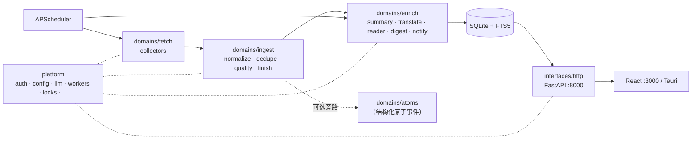

# Personal Info Monitor (PIM)

> 本地优先的资讯监控与摘要系统：聚合 **RSS / 网站 / X / YouTube / Podcast** 等
> 内容源，按调度抓取，自动去重 / 关键词匹配 / 摘要 / 翻译，生成日报与
> 3 小时简报，并通过桌面端 / 浏览器 / `pimctl` CLI 三个入口消费。

## 一句话架构

- **后端** — FastAPI + SQLAlchemy 2 + SQLite (FTS5) + APScheduler，按
  `interfaces / domains / platform` 三层组织，导入边界由 CI 静态强制。
- **前端** — Vite + React + Ant Design，Tauri 提供可选桌面壳。
- **CLI** — `pimctl`（Click 包），通过 HTTP+`X-API-Key` 调用后端，不直接访问数据库。
- **数据** — 单一 SQLite 数据库（`~/.pim/data/pim.db` 默认）+ `data_dir/` 下
  cookies / Playwright storage-state / metrics checkpoint 等文件。



详细层次见 [`docs/ARCHITECTURE.md`](docs/ARCHITECTURE.md)；模块边界一页纸见
[`docs/MODULE_BOUNDARIES.md`](docs/MODULE_BOUNDARIES.md)；每个文件/文件夹的
作用见 [`docs/PROJECT_STRUCTURE.md`](docs/PROJECT_STRUCTURE.md)。

## 固定端口

| 端口 | 服务 | 说明 |
|---|---|---|
| `127.0.0.1:8000` | 后端 API | dev / prod / 服务模式相同 |
| `localhost:3000` | 前端 dev server | 仅 `pim start` 开发模式 |
| `tauri.localhost` | Tauri 桌面应用 | 复用同一后端 |

## 快速开始

### 首次安装

要求：Python 3.11+、Node.js 18+、npm。Tauri 桌面端额外需要 Rust 工具链。

```bash
git clone <repo-url> personal-info-monitor
cd personal-info-monitor
./pim setup       # 创建 backend/venv、装依赖、Playwright Chromium、前端依赖
```

`./pim setup` 同时生成 `backend/.env` 模板与 `~/.pim/data/runtime-secrets.json`
（含 `PIM_API_KEY` 与 `ENCRYPTION_KEY`，不会回写到 `.env`）。

### 日常启动（推荐：后台服务）

```bash
./pim install-service   # 注册 macOS LaunchAgent，立即启动
./pim status            # PID / 启动时间 / 健康状态
./pim logs              # 实时日志
./pim stop              # 暂停服务（重启仍会自动恢复）
./pim uninstall-service # 彻底卸载
```

### 开发模式（前后端热重载）

```bash
./pim start         # 前端 :3000 + 后端 :8000 同终端启动
./pim start --prod  # 后台运行，FastAPI 同时提供 API 与已构建的前端静态资源
```

完整运维细节见 [`docs/LOCAL_RUN.md`](docs/LOCAL_RUN.md) 与
[`docs/VPS_DEPLOY.md`](docs/VPS_DEPLOY.md)。

## 配置

主配置：`backend/.env`（从 `backend/.env.example` 复制）。运行时密钥
（`PIM_API_KEY`、`ENCRYPTION_KEY`）自动生成在 `~/.pim/data/runtime-secrets.json`，
**不会写回 `.env`**。

| 变量 | 默认 | 说明 |
|---|---|---|
| `DATA_DIR` | `~/.pim/data` | SQLite 主库与日志目录 |
| `FETCH_CONCURRENCY` | `20` | 并发抓取上限 |
| `AI_PROCESSING_ENABLED` | `true` | LLM master kill switch（与 `ENRICH_*` 同时检查） |
| `ENRICH_AUTO_ON_INGEST` | `false` | ingest 完成后是否自动触发 enrich 流水线 |
| `ENRICH_SUMMARY_ENABLED` | `true` | 允许 Summarizer 调 LLM 生成摘要 |
| `ENRICH_TRANSLATE_ENABLED` | `true` | 允许 Translator 调 LLM 做翻译 |
| `ATOMS_ENABLED` | `false` | 可选 atoms 结构化原子事件层（Phase 6） |
| `OPENAI_API_KEY` | — | 云端模型凭据（可选） |
| `RSSHUB_URL` | `https://rsshub.app` | RSSHub 实例 |
| `CORS_ORIGINS` | 内置三组 | 允许的前端来源 |
| `TRUSTED_PROXY_IPS` | — | 反向代理 IP（VPS 必填） |
| `API_RATE_LIMIT_PER_MINUTE` | `120` | 每分钟每 IP 限速，`0` 关闭 |

默认 CORS 白名单已覆盖 `http://localhost:3000`、`http://127.0.0.1:3000`、
`http://tauri.localhost`、`https://tauri.localhost`、`http://localhost:1420`。

## pimctl — 给 Agent / 脚本调用

```bash
./pimctl auth login --server http://127.0.0.1:8000 --api-key <key>
# 查 API Key
cat ~/.pim/data/runtime-secrets.json | jq -r .api_key

./pimctl system health --json
./pimctl sources list --json
./pimctl sources add --url https://example.com/feed --type rss
./pimctl contents search "openai" --json
./pimctl settings get --json
```

完整命令树见 [`docs/PIMCTL_REFERENCE.md`](docs/PIMCTL_REFERENCE.md) 与
[`docs/CLI_SPEC.md`](docs/CLI_SPEC.md)。Agent 集成方式见
[`docs/AGENT_GUIDE.md`](docs/AGENT_GUIDE.md)。

## API

| 端点 | 鉴权 | 用途 |
|---|---|---|
| `GET /livez` | 否 | 探活 |
| `GET /health` | `X-API-Key` | 健康检查 |
| `GET /api/system/metrics` | `X-API-Key` | JSON 指标 |
| `GET /metrics` | `X-API-Key` | Prometheus 文本 |
| `GET /docs` / `GET /redoc` | 否 | Swagger / ReDoc |

所有 `/api/*` 路由都要求 `X-API-Key` header；指南与 `rate()` 查询样例见
[`docs/API_GUIDE.md`](docs/API_GUIDE.md)。

## 数据库 / 备份 / 回滚

```bash
./pim backup                 # SQLite 热备份 + .env + runtime-secrets 归档到 ~/.pim/backups/
./pim rollback <revision>    # 回滚到指定 Alembic revision
cd backend && alembic upgrade head   # 手动升级到最新 schema
```

应用启动时会自动执行 `alembic upgrade head`。

## 测试与质量门

```bash
# 后端
cd backend
./venv/bin/pytest -q --no-cov           # 全部 914 个测试
./venv/bin/ruff check app               # lint
./venv/bin/python scripts/check_domain_imports.py --phase=7   # 架构边界

# 前端
cd frontend
npm test           # Vitest
npm run build      # 类型检查 + 产物
npx playwright test   # E2E
```

CI 在 [`.github/workflows/ci.yml`](.github/workflows/ci.yml) 中串行执行
ruff / mypy(stub) / domain-import 静态边界 / pytest / vitest / playwright，
全部通过才允许合并。

## 文档地图

| 用途 | 文档 |
|---|---|
| **架构总览** | [`docs/ARCHITECTURE.md`](docs/ARCHITECTURE.md) |
| **每个文件/文件夹做什么** | [`docs/PROJECT_STRUCTURE.md`](docs/PROJECT_STRUCTURE.md) |
| **模块边界（一页纸）** | [`docs/MODULE_BOUNDARIES.md`](docs/MODULE_BOUNDARIES.md) |
| **重构 Phase 0–7 记录** | [`docs/MODULE_REFACTOR_PLAN.md`](docs/MODULE_REFACTOR_PLAN.md) |
| **架构决策记录** | `docs/ADR-001-local-monolith.md` … `docs/ADR-005-module-boundaries.md` |
| **用户使用指南** | [`docs/USER_GUIDE.md`](docs/USER_GUIDE.md) |
| **Agent 集成** | [`docs/AGENT_GUIDE.md`](docs/AGENT_GUIDE.md) |
| **pimctl 命令参考** | [`docs/PIMCTL_REFERENCE.md`](docs/PIMCTL_REFERENCE.md) |
| **CLI 设计规格** | [`docs/CLI_SPEC.md`](docs/CLI_SPEC.md) |
| **本地运行细节** | [`docs/LOCAL_RUN.md`](docs/LOCAL_RUN.md) |
| **VPS 部署** | [`docs/VPS_DEPLOY.md`](docs/VPS_DEPLOY.md) |
| **API 指南 + Prometheus** | [`docs/API_GUIDE.md`](docs/API_GUIDE.md) |
| **故障排查** | [`docs/TROUBLESHOOTING.md`](docs/TROUBLESHOOTING.md) |
| **后端 README** | [`backend/README.md`](backend/README.md) |
| **前端 README** | [`frontend/README.md`](frontend/README.md) |
| **历史审计与归档** | [`docs/reviews/README.md`](docs/reviews/README.md) |

## 故障排查速查

| 现象 | 处理 |
|---|---|
| 服务没起来 | `./pim logs` 看最近错误；`./pim status` 看 PID |
| 8000 端口被占 | `lsof -i :8000` 杀掉占用进程，服务自动恢复 |
| API Key 忘了 | `cat ~/.pim/data/runtime-secrets.json` |
| `pimctl` 认证失败 | `./pimctl auth login` 重新登录 |
| 数据库 schema 不一致 | `cd backend && alembic upgrade head` 或 `./pim rollback <rev>` |

详尽案例见 [`docs/TROUBLESHOOTING.md`](docs/TROUBLESHOOTING.md)。

## 许可证

[MIT](LICENSE)
