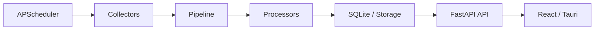
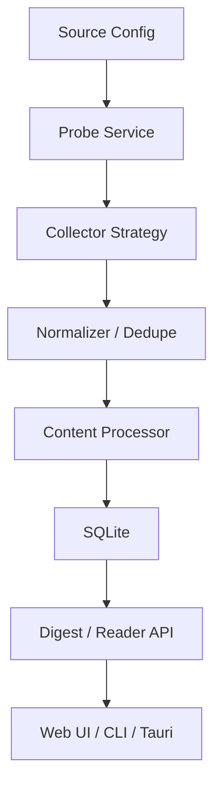
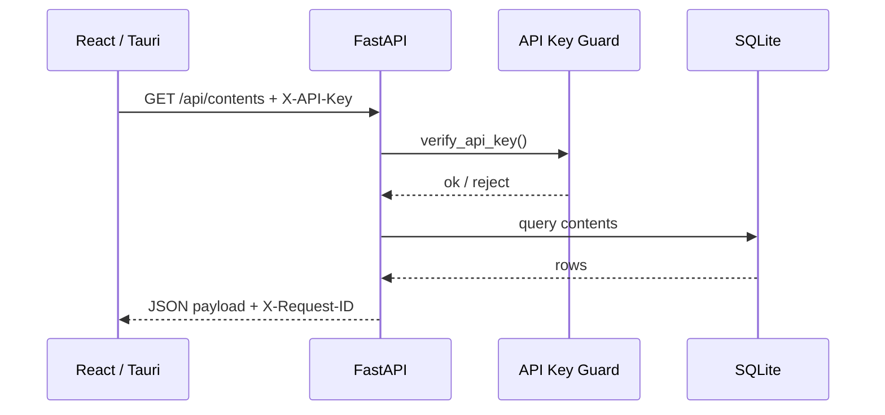

# Personal Info Monitor

个人化资讯监控与摘要系统：聚合网站、RSS、X、YouTube、播客等内容源，支持抓取探测、关键词监控、摘要与翻译，以及日报/小时报展示。

## 当前架构

项目当前已收敛为单体本地架构：

- 后端：FastAPI + SQLAlchemy + SQLite + APScheduler
- 前端：Vite + React + Ant Design
- 桌面端：Tauri（调用本地 FastAPI）

当前仓库不再把 Docker、PostgreSQL、Redis、Celery 作为主运行路径。若你在旧文档或历史报告里看到这些内容，应以本 README 和 `./pim` 为准。







## 功能概览

- 多源采集：网站、RSS、X、YouTube、播客
- 抓取探测：自动判断 RSS、网页抓取、RSSHub、Nitter、API 等策略
- AI 能力解耦：抓取链路不依赖模型；翻译按需触发；小时简报仅在模型可用时生成
- 内容管理：已读、收藏、归档、关键词高亮
- 统计与简报：Dashboard、日报、小时报
- 系统配额：支持监控源上限与小时简报输入上限配置

## 快速开始

### 1. 初始化

要求：

- Python 3.11+
- Node.js 18+
- npm

执行：

```bash
./pim setup
```

这会完成：

- 创建 `backend/.venv`
- 安装后端依赖
- 安装 Playwright Chromium
- 生成本地 `backend/.env` 配置模板（如不存在）
- 初始化 `DATA_DIR/runtime-secrets.json` 中的运行时密钥
- 安装并构建前端

### 2. 开发模式

```bash
./pim start
```

开发模式下：

- 前端开发服务器：`http://localhost:3000`
- 后端 API：`http://127.0.0.1:8000`
- 前端 `/api` 请求会自动代理到后端

### 3. 生产/单进程模式

```bash
./pim start --prod
```

生产模式下：

- 单个 FastAPI 进程同时提供 API 与已构建的前端静态资源
- 访问地址：`http://127.0.0.1:8000`

如果前端尚未构建，可先执行：

```bash
cd frontend
npm run build
```

## 常用命令

```bash
./pim setup
./pim start
./pim start --prod
./pim stop
./pim status
./pim fetch
./pim backup
./pim rollback <revision>
./pim logs
./pimctl --help
```

## CLI / Agent 使用

项目现在提供两层命令入口：

- `./pim`：本地安装、启动、停止、日志等运维命令
- `./pimctl`：业务能力命令，适合脚本和 Agent 调用

示例：

```bash
./pimctl system health --server http://127.0.0.1:8000 --json
./pimctl auth login --server http://127.0.0.1:8000 --api-key <your-key>
./pimctl sources list --json
./pimctl contents search "openai" --json
./pimctl settings get --json
./pimctl settings limits --json
```

完整规划见 [docs/CLI_SPEC.md](docs/CLI_SPEC.md)。

## API 文档与运维端点

- Swagger UI：`http://127.0.0.1:8000/docs`
- ReDoc：`http://127.0.0.1:8000/redoc`
- 手写 API 指南：`docs/API_GUIDE.md`
- 轻量探活：`GET /livez`
- 详细健康检查：`GET /health`（需要 `X-API-Key`）
- 运行指标：`GET /api/system/metrics`
- Prometheus 指标：`GET /metrics`（需要 `X-API-Key`）

## 配置与密钥

主要配置文件为 `backend/.env`，用于保存可选运行参数。运行时密钥默认保存在 `DATA_DIR/runtime-secrets.json`，不再由启动流程回写到 `.env`。

常用 `.env` 项如下：

| 变量 | 说明 |
|------|------|
| `DATA_DIR` | SQLite 数据目录 |
| `FETCH_CONCURRENCY` | 抓取并发数 |
| `AI_PROCESSING_ENABLED` | 是否启用 AI 处理 |
| `OPENAI_API_KEY` | 可选，云端模型 API Key |
| `RSSHUB_URL` | 可选，RSSHub 地址 |
| `CORS_ORIGINS` | 允许的前端来源，支持逗号或换行分隔 |

如果你希望显式覆盖默认密钥，也仍然可以在环境变量或 `.env` 中手动设置：

- `PIM_API_KEY`
- `ENCRYPTION_KEY`
- `JWT_SECRET_KEY`

模板见 `backend/.env.example`。

## 数据库迁移

后端现在通过 Alembic 管理 schema 演进。应用启动时会自动执行迁移；如果你手动维护后端环境，也可以执行：

```bash
cd backend
./.venv/bin/alembic upgrade head
```

如果需要回滚到旧 revision，也可以执行：

```bash
./pim rollback 20260330_0001
```

## 备份

项目提供轻量本地备份入口：

```bash
./pim backup
```

该命令会：

- 生成 SQLite 热备份
- 归档 `backend/.env` 与 `runtime-secrets.json`（若存在）

## 手动启动

### 后端

```bash
cd backend
python3 -m venv .venv
. .venv/bin/activate
pip install -r requirements.txt
./.venv/bin/alembic upgrade head
uvicorn app.main:app --host 127.0.0.1 --port 8000 --reload
```

### 前端

```bash
cd frontend
npm install
VITE_API_URL=http://127.0.0.1:8000 npm run dev
```

## 文档

- 本地运行说明：`docs/LOCAL_RUN.md`
- VPS 部署说明：`docs/VPS_DEPLOY.md`
- 后端说明：`backend/README.md`
- API 使用指南：`docs/API_GUIDE.md`
- 故障排查：`docs/TROUBLESHOOTING.md`
- 架构 ADR：`docs/ADR-001-local-monolith.md`

## 测试

后端：

```bash
cd backend
./.venv/bin/pytest -q
```

前端：

```bash
cd frontend
npm test
npm run build
```

## 故障排查

常见问题见 [docs/TROUBLESHOOTING.md](docs/TROUBLESHOOTING.md)。

快速提示：

- 后端起不来：先看 `./pim logs`
- CLI 探活失败：确认 `http://127.0.0.1:8000/livez` 可访问
- 认证失败：重新执行 `./pimctl auth login`
- 浏览器会话校验失败：查看服务端日志，不再向客户端暴露底层异常细节

## 许可证

[MIT](LICENSE)
