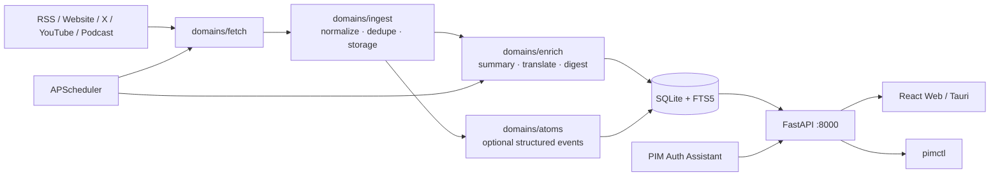

# Personal Info Monitor (PIM)

> 本地优先的个人资讯监控系统。PIM 把 RSS、网站、X、YouTube、Podcast 等来源统一抓取、去重、评分、摘要和归档，并提供 Web UI、桌面端、`pimctl` CLI 与远程部署运维能力。

当前版本：**1.6.9**

> 分支提示：`main` 暂时冻结原子库产品入口；原子库相关能力保留在 `dev` 分支继续探索，详见 [`docs/ATOM_FREEZE_MAIN.md`](docs/ATOM_FREEZE_MAIN.md)。

## 1.6.9 重点

- **Event v1 稳定内核与灰度链路**：新增稳定 UUIDv7 Event、结构化签名、多通道召回、来源独立性、meaningful Snapshot、有界重平衡及 v0/v1 双跑审计；生产读切换继续由正式评测与 Shadow 门禁保护。
- **可靠执行与正式质量闭环**：落地 durable job、SchedulerRun、Transactional Outbox、lineage、SQLite single writer，以及 Core/Event/Ranking/Calibration 正式评测和 fail-closed release artifact。
- **Web 升级兼容 detached HEAD**：自动把 detached checkout 所需的 `--no-pull` 与 `PIM_UI_UPGRADE_ARGS` 合并，外部进程管理器使用 `--no-restart` 时不再因参数覆盖而失败。
- **可观测与运维加固**：补充 Event 指标、诊断和操作 API、迁移/回填/性能基准，并保持生产灰度开关默认关闭。

## 1.6.8 重点

- **今日重点只保留必看事件**：统一按事件分、增量性和置信度判定，移除“酝酿中”卡片，并允许只有一条必看事件时正常展示。
- **单篇事件门槛一致**：必看事件分线调整为 70，使极高价值、高置信的单篇报道可以入选，同时拦截未达到必看条件的普通单源线索。
- **事件名称独立于文章标题**：为事件生成更短、更中性的名称，去除早报、快讯和情绪化标题框架，同时保留原文章标题供阅读页使用。
- **升级与阅读体验修复**：包含升级流程加固和阅读界面精简，提升服务器升级可靠性与正文阅读聚焦度。

## 1.6.7 重点

- **依赖安全修复**：将 `httplib2` 升级到 0.32.0，消除 `PYSEC-2026-3444` 安全告警。
- **恢复前端 E2E 门禁**：端到端测试跟进资讯列表迁移到 `/timeline` 后的路由与页面标题。
- **校准死代码基线**：记录动态 Pydantic/配置字段产生的新增误报，保持质量门禁可重复。

## 1.6.6 重点

- **统一 AI 产品策略**：集中管理摘要、翻译和主观评分的启停与运行状态，并正确识别主模型和 fallback，支持部署级硬停以及评分 shadow 模式。
- **新增今日重点**：提供独立的每日重点入口、阅读时长与高置信事件概览，同时在简报中保持一致的重点展示体验。
- **付费来源健康矩阵**：新增站点级全文命中率、登录会话和抓取状态汇总，帮助快速定位订阅来源的认证或正文提取问题。

## 1.6.5 重点

- **修复生产列表卡死**：将 `duplicate_group_id` JSON path 以内联 SQL 常量生成，使 SQLAlchemy 参数化查询能够真正命中 `ix_contents_dup_group_id` 表达式索引。
- **统一重复组索引查询**：资讯可见性和抓取去重成员查询共用同一索引表达式，避免抓取流水线再次退化为 JSON 全表扫描。
- **回归测试覆盖真实 ORM SQL**：直接以参数化编译结果运行 `EXPLAIN QUERY PLAN`，防止 `literal_binds` 掩盖 SQLite 表达式索引失效。

## 1.6.4 重点

- **依赖安全修复**：升级 `click` 与 `soupsieve`，消除后端安全扫描报告的已知漏洞。
- **诊断降级更精确**：支持包只捕获数据库、调度器和文件系统的预期异常，避免意外编程错误被静默吞掉，并恢复代码质量门禁。
- **CI 门禁可重复**：固定死代码扫描器版本，并同步审计后的死代码与大文件基线，避免上游规则漂移或陈旧预算随机阻断发布。
- **延续抓取稳定性修复**：完整包含 v1.6.3 的资讯列表索引、20 路活动抓取并发和批量后处理优化。

## 1.6.3 重点

- **资讯列表恢复**：为历史近重复组查询增加 SQLite 表达式索引，修复 3 万余条内容时 `/api/contents` 长时间无响应的问题。
- **恢复 20 路抓取**：将同步 ORM、HTML 解析和正文处理移出 uvicorn event loop，保留历史默认的 20 路活动抓取并发。
- **消除 v1.6 写放大**：后处理任务改为按来源批量持久化，并跳过关闭翻译或无需翻译时的空任务，减少 SQLite 事务竞争。

## 1.6.2 重点

- **抓取与升级可靠性**：阻止无效的零抓取并发配置造成队列停摆；修复 detached checkout 的 Web 升级策略，并补充部署配置说明。
- **事件与个人规则**：已激活的规则会实际作用于今日事件；补齐后处理任务的重试上限与事件反馈参数校验。
- **设置页重组**：将诊断包归入抓取健康；合并登录凭据与 Auth Assistant；将任务提示归入模型配置，并将系统维护更名为系统升级。

## 1.6.1 重点

- **稳定性修复**：限制 aiosqlite 并发连接，释放跨网络/LLM await 持有的数据库连接，并自动恢复僵尸后处理任务。

- **Event v0 与个人监控**：新增稳定事件、版本已读、事件详情、阅读状态与“观察 → 建议 → 规则”流程。
- **后处理可靠性**：新增持久化任务、结构化失败分类、重试与 dead-letter 状态。
- **抓取与导出治理**：拆分 sitemap 采集逻辑，严格区分 Event 与近重复组，并支持归因优先的 Markdown 导出。

- **Auth Assistant**：在 VPS 上生成一次性配对码，本地桌面助手采集浏览器登录态后上传到远程 PIM。它只拿到受限设备令牌，不会接触 PIM 管理 API Key。
- **站点抓取兜底增强**：普通网站解析不再因为先命中 5 条内容就跳过全页 `<a href>` 扫描；默认最多保留 50 条候选，更适合财联社这类首页要闻和快讯混排页面。
- **X 探测认证修复**：源级 `metadata/auth_config` 中的 `auth_token`、`ct0` 会优先参与 probe，不再只看全局配置。
- **重复内容标记**：新增 `is_duplicate`、`duplicate_of` 字段，列表默认收敛同标题/同事件重复项，历史 `duplicate_group_id` 也会兼容折叠。
- **更新检查**：Web 侧栏和系统维护页会读取 GitHub Releases，发现新版本时引导升级。
- **抓取流水线降阻塞**：若干数据库提交、存储与重复检测路径移到后台线程执行，减少异步调度被同步 I/O 卡住的概率。

## 架构速览



- 后端：FastAPI + SQLAlchemy 2 + SQLite/FTS5 + APScheduler。
- 前端：Vite + React + Ant Design，Tauri 提供桌面壳。
- CLI：`pimctl` 只通过 HTTP API 工作，不直接读写数据库。
- 数据目录：默认 `~/.pim/data`，包含 SQLite、运行时密钥、浏览器会话、日志和指标 checkpoint。

更完整的边界说明见 [`docs/ARCHITECTURE.md`](docs/ARCHITECTURE.md)、[`docs/MODULE_BOUNDARIES.md`](docs/MODULE_BOUNDARIES.md) 和 [`docs/PROJECT_STRUCTURE.md`](docs/PROJECT_STRUCTURE.md)。

## 快速开始

要求：Python 3.11+、Node.js 18+、npm。构建 Tauri 桌面端还需要 Rust。

```bash
git clone --depth 1 https://github.com/wangbubu2023/personal-info-monitor.git
cd personal-info-monitor
./pim setup
./pim start
```

首次 `setup` 会安装后端、前端和浏览器依赖，并生成：

- `backend/.env`
- `~/.pim/data/runtime-secrets.json`
- `~/.pim/data/pim.db`

新安装未配置模型时不会发起 outbound LLM。配置模型后，在「设置 → AI 模型」控制自动摘要、列表翻译、主观评分和全局暂停；页面会区分模型已配置、运行时就绪、预算耗尽和 Provider 失败。部署级紧急停机使用 `PIM_AI_HARD_DISABLE=true`。

## 常用运行方式

### 本机开发

```bash
./pim start         # 后端 :8000 + 前端 :3000
./pim start --prod  # 单进程服务，后端同时托管已构建前端
./pim stop
./pim status
./pim logs
```

### macOS 后台服务

```bash
./pim install-service
./pim status
./pim upgrade
./pim uninstall-service
```

`./pim upgrade` 会执行备份、`git pull --ff-only`、依赖刷新、前端构建和服务重启。tag/detached 部署可用：

```bash
./pim upgrade --no-pull
```

## Web UI

默认入口：

- 后端 API：`http://127.0.0.1:8000`
- 开发前端：`http://127.0.0.1:3000`
- 生产 Web：`http://127.0.0.1:8000`

主要页面：

- 资讯流：搜索、筛选、查看正文与摘要。
- 信源管理：添加 RSS、网站、X、YouTube、Podcast，查看抓取健康状态。
- 设置：抓取健康、登录与凭据（含 Auth Assistant）、模型配置（含任务提示）、系统升级。
- 系统升级：备份、升级与 GitHub Release 更新检查；诊断包位于抓取健康。

## Auth Assistant

Auth Assistant 用来解决“PIM 跑在 VPS，但登录态只能在本地浏览器里拿到”的问题。

推荐流程：

1. 在远程 PIM Web 打开 `设置 -> Auth Assistant`。
2. 点击页面里的“下载 macOS 版”，或从 [GitHub Releases](https://github.com/wangbubu2023/personal-info-monitor/releases/latest) 下载 `PIM-Auth-Assistant-macOS-arm64.dmg`。
3. 在远程 PIM Web 生成 10 分钟有效的一次性配对码。
4. 在本地打开 PIM Auth Assistant，填入远程 PIM 地址和配对码完成连接。
5. 本地采集 X、WSJ、NYTimes 等站点登录态。
6. 上传到 PIM，后端会导入为 Auth Config / Browser Session，并自动绑定匹配信源。

安全边界：

- 配对码一次性使用，过期失效。
- 本地助手只保存设备令牌，不能调用管理 API。
- PIM 端可随时在设置页移除已配对设备。

开发运行：

```bash
cd auth-assistant
npm install
npm run dev
```

桌面版使用独立的 Tauri 登录窗口采集目标站点 Cookie，不依赖本机安装 PIM CLI 或保留源码仓库。

## 网站抓取策略

PIM 的网站源会先尝试结构化解析、列表发现和站点规则，再用全页链接兜底。

1. 默认 discovery 会从来源 URL 扫描同域文章链接。
2. 全页 `<a href>` 兜底默认最多补到 50 条文章候选。
3. 可通过源 metadata 调整：

```json
{
  "fallback_link_max": 80,
  "discovery_default_max_links": 50,
  "discovery": {
    "mode": "listing",
    "listing_urls": ["https://www.example.com/news"],
    "max_links": 50,
    "url_allow_patterns": ["/detail/", "/article/"]
  }
}
```

对财联社这类页面，兜底扫描会覆盖中间要闻区和右侧电报区，而不再只保存最先解析到的少量卡片。

## X 与登录态

X 抓取优先使用浏览器登录态 Cookie 的 GraphQL 路径，然后才尝试 RSSHub / Nitter。

可用来源：

- 源级 `metadata.auth_config` 或绑定的 Auth Config。
- 全局 `X_AUTH_TOKEN` / `X_CT0_TOKEN`。
- 显式配置的官方 X API fallback。

官方 X API 不会因为设置了 `X_BEARER_TOKEN` 自动启用；只有单个信源设置 `metadata.strategy=api` 或 `metadata.allow_x_api_fallback=true` 时才会调用。

## 配置

主配置在 `backend/.env`。运行时密钥在 `~/.pim/data/runtime-secrets.json`，不会回写到 `.env`。

| 变量 | 默认 | 说明 |
|---|---|---|
| `DATA_DIR` | `~/.pim/data` | SQLite、日志、浏览器会话目录 |
| `PIM_PUBLIC_URL` | 空 | VPS / 反向代理公网地址 |
| `FETCH_CONCURRENCY` | `20` | 并发抓取上限；同步 DB 连接池会自动至少按该值配置，并额外保留 10 个 overflow 连接 |
| `PIM_AI_HARD_DISABLE` | `false` | 部署级 LLM 紧急停机开关；产品功能开关在 Web 设置中管理 |
| `AI_DAILY_TOKEN_BUDGET` / `AI_MONTHLY_TOKEN_BUDGET` | `0` | 持久化的 LLM Token 预算；`0` 不限制 |
| `ATOMS_ENABLED` | `false` | 结构化事件层；`main` 分支暂时强制冻结，`dev` 分支可继续探索 |
| `OPENAI_API_KEY` | 空 | 云端模型凭据 |
| `RSSHUB_URL` | `https://rsshub.app` | RSSHub 实例 |
| `X_BEARER_TOKEN` | 空 | 官方 X API fallback 凭据 |
| `PIM_UPDATE_CHECK_REPO` | `wangbubu2023/personal-info-monitor` | GitHub Release 更新检查仓库 |
| `PIM_UPDATE_CHECK_GITHUB_TOKEN` | 空 | 可选 GitHub token，避免共享出口 IP 的匿名 API 限流 |
| `API_RATE_LIMIT_PER_MINUTE` | `120` | API 限速，`0` 关闭 |
| `PIM_BROWSER_BACKEND` | `patchright` | 浏览器后端，可设为 `playwright` |

旧版 `AI_PROCESSING_ENABLED`、`ENRICH_*` 和 `PIM_SCORE_LLM_SUBJECTIVE`
只在首次升级时事务化迁移一次。迁移后以 `system_settings` 为唯一产品控制面，
环境变量变化不会覆盖用户选择。
| `PIM_PLAYWRIGHT_CHANNEL` | `none` | 可设为 `chrome` 使用系统 Chrome |

默认 CORS 覆盖 `localhost:3000`、`127.0.0.1:3000`、`tauri.localhost` 和 Tauri 开发端口。

## pimctl

登录一次后，后续命令可省略 `--server` 和 `--api-key`。

```bash
jq -r .PIM_API_KEY ~/.pim/data/runtime-secrets.json
./pimctl auth login --server http://127.0.0.1:8000 --api-key <key>

./pimctl system health --json
./pimctl sources list --json
./pimctl sources add --url https://example.com/feed --type rss
./pimctl contents search "AI" --json
./pimctl digest latest --json
./pimctl settings get --json
```

完整命令见 [`docs/PIMCTL_REFERENCE.md`](docs/PIMCTL_REFERENCE.md)，Agent 集成见 [`docs/AGENT_GUIDE.md`](docs/AGENT_GUIDE.md)。

## API

| 端点 | 鉴权 | 用途 |
|---|---|---|
| `GET /livez` | 否 | 探活 |
| `GET /health` | `X-API-Key` | 健康检查 |
| `GET /api/system/metrics` | `X-API-Key` | JSON 指标 |
| `GET /metrics` | `X-API-Key` | Prometheus 文本 |
| `GET /api/system/update-check` | `X-API-Key` | GitHub Release 更新检查 |
| `POST /api/auth-assistant/pairing-tokens` | `X-API-Key` | 创建 Auth Assistant 配对码 |
| `POST /api/auth-assistant/pair` | 配对码 | 本地助手换取设备令牌 |
| `POST /api/auth-assistant/auth-bundles/import` | 设备令牌 | 上传单个登录态 bundle |
| `POST /api/auth-assistant/auth-exports/import` | 设备令牌 | 上传登录态 zip |
| `GET /docs` / `GET /redoc` | 否 | Swagger / ReDoc |

所有普通 `/api/*` 路由都要求 `X-API-Key`。Auth Assistant 的导入端点使用受限设备令牌。

## 数据库、备份与回滚

```bash
./pim backup
./pim upgrade
./pim rollback <revision>
cd backend && alembic upgrade head
```

应用启动时会自动执行 `alembic upgrade head`。

重要迁移：

- `20260708_0027_content_duplicate_markers.py`：为内容表添加重复标记并回填历史同组数据。
- `20260709_0028_auth_assistant_pairing.py`：新增 Auth Assistant 配对、设备和导入审计表。

VPS 首次登录 Web UI 时可生成公网引导链接：

```bash
./pim bootstrap-url --origin https://your-domain.com
```

本地采集并上传远程登录态：

```bash
./pim login-sync https://example.com --remote pim@your-vps --remote-pim ~/personal-info-monitor
```

## 测试与质量门

```bash
cd backend
PYTHONPATH=. .venv/bin/python -m pytest
PYTHONPATH=. .venv/bin/ruff check app
PYTHONPATH=. .venv/bin/python scripts/check_domain_imports.py --phase=7

cd ../frontend
npm test
npm run build

cd ../auth-assistant
npm run build
```

CI 运行后端 lint、架构边界、pytest，前端 lint、Vitest、npm audit，以及安全扫描。Playwright E2E 仍建议本地按需执行。

## RSS 标题乱码修复

RSS/XML 抓取会保留原始响应 bytes 交给 feedparser 做编码检测。升级前已经写入数据库的
latin-1/cp1252 mojibake 标题，可先在后端目录执行只读预览：

```bash
cd backend
.venv/bin/python scripts/repair_mojibake_titles.py
```

确认列出的每一项后再追加 `--apply`。脚本仅扫描 RSS、默认跳过用户手工编辑的标题、只接受
严格可逆的 UTF-8 修复，并在写入前创建 `pim.db.pre-mojibake-*.bak`。可用
`--content-id <UUID>` 将范围限制到已确认的记录；脚本不会使用替换字符强行修复不可逆数据。

## 发布

发布稳定版本时保持 Auth Assistant 在内的版本源一致：

- `backend/pyproject.toml`
- `frontend/package.json`
- `frontend/src-tauri/tauri.conf.json` / `frontend/src-tauri/Cargo.toml`
- `auth-assistant/package.json`
- `auth-assistant/src-tauri/tauri.conf.json` / `auth-assistant/src-tauri/Cargo.toml`

然后提交、打 tag，并创建 GitHub Release。Web 更新检查依赖 GitHub Releases 的 `latest` 端点，仅推 tag 不会触发“发现新版本”提示。

```bash
git commit -m "release: 1.6.9"
git tag -a v1.6.9 -m "Release 1.6.9"
git push origin main v1.6.9
gh release create v1.6.9 --title "v1.6.9" --notes-file /tmp/pim-release-notes.md
```

发布 GitHub Release 后，`Release Auth Assistant for macOS` workflow 会构建 arm64 DMG、使用
Developer ID Application 签名并提交 Apple notarization，验证通过后上传固定文件名
`PIM-Auth-Assistant-macOS-arm64.dmg`。仓库需配置以下 Actions secrets：

- `APPLE_CERTIFICATE`：Developer ID Application `.p12` 的 base64 内容。
- `APPLE_CERTIFICATE_PASSWORD`、`KEYCHAIN_PASSWORD`。
- `APPLE_ID`、`APPLE_PASSWORD`（app-specific password）、`APPLE_TEAM_ID`。

本地无 Apple 证书时会使用 ad-hoc 签名，适合开发验证，不应作为 GitHub Release 公开分发。

## 文档地图

| 用途 | 文档 |
|---|---|
| 架构总览 | [`docs/ARCHITECTURE.md`](docs/ARCHITECTURE.md) |
| 项目结构 | [`docs/PROJECT_STRUCTURE.md`](docs/PROJECT_STRUCTURE.md) |
| 模块边界 | [`docs/MODULE_BOUNDARIES.md`](docs/MODULE_BOUNDARIES.md) |
| 用户指南 | [`docs/USER_GUIDE.md`](docs/USER_GUIDE.md) |
| Agent 集成 | [`docs/AGENT_GUIDE.md`](docs/AGENT_GUIDE.md) |
| pimctl 参考 | [`docs/PIMCTL_REFERENCE.md`](docs/PIMCTL_REFERENCE.md) |
| 本地运行 | [`docs/LOCAL_RUN.md`](docs/LOCAL_RUN.md) |
| VPS 部署 | [`docs/VPS_DEPLOY.md`](docs/VPS_DEPLOY.md) |
| API 指南 | [`docs/API_GUIDE.md`](docs/API_GUIDE.md) |
| 故障排查 | [`docs/TROUBLESHOOTING.md`](docs/TROUBLESHOOTING.md) |
| 贡献规则 | [`docs/CONTRIBUTING.md`](docs/CONTRIBUTING.md) |

## 故障排查速查

| 现象 | 处理 |
|---|---|
| 服务没起来 | `./pim status` 看 PID，`./pim logs` 看最近错误 |
| 8000 端口被占 | `lsof -i :8000` 找占用进程后处理 |
| API Key 忘了 | `jq -r .PIM_API_KEY ~/.pim/data/runtime-secrets.json` |
| `pimctl` 认证失败 | `./pimctl auth login` 重新登录 |
| schema 不一致 | `cd backend && alembic upgrade head` |
| 远程站点抓不到登录内容 | 用 Auth Assistant 重新采集并上传对应站点登录态 |
| X probe 失败 | 检查源级 Auth Config 或全局 `X_AUTH_TOKEN` / `X_CT0_TOKEN` |

## License

[MIT](LICENSE)
