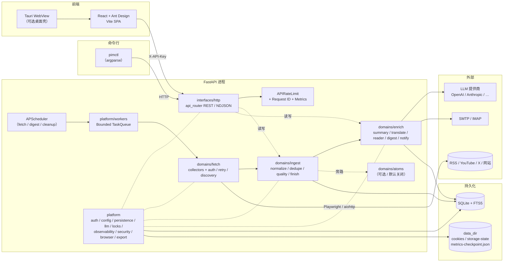
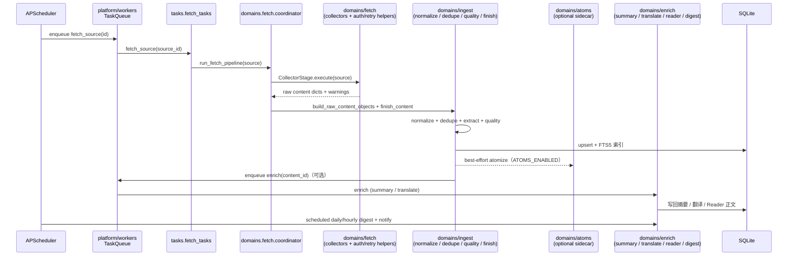
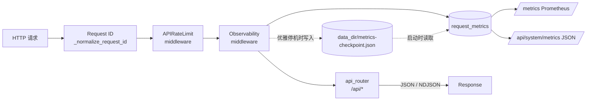
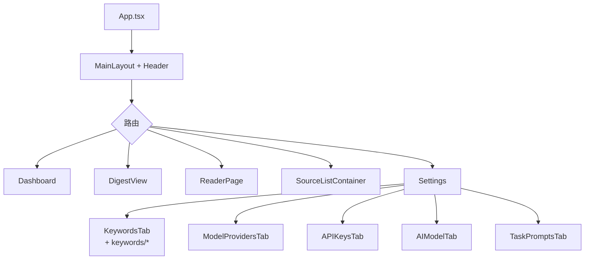

# PIM 架构总览

> 本文档描述**当前运行时代码**的架构（蓝图 Phase 0–7 已落地）。模块边界
> 速查见 [`MODULE_BOUNDARIES.md`](./MODULE_BOUNDARIES.md)，全量目录注解见
> [`PROJECT_STRUCTURE.md`](./PROJECT_STRUCTURE.md)，导入约束见
> `backend/scripts/check_domain_imports.py`。
>
> 具体实现细节（配置、部署、CLI）请参考 `README.md`、`docs/LOCAL_RUN.md`、
> `docs/VPS_DEPLOY.md`、`docs/PIMCTL_REFERENCE.md`。

## 1. 系统分层

PIM 是一个本地优先的单体应用：一个 FastAPI 后端 + 一个 React/Tauri 前端
+ 一个 Python CLI（`pimctl`），全部共享同一份 SQLite 数据库。



- **前端**：纯 SPA，所有 API 调用都带 `X-API-Key`。Tauri 只是一个可选外壳，加载同一个 SPA。
- **CLI**：`pimctl` 是一个独立的 argparse 包（`cli/pimctl/`），通过 HTTP 访问后端，不直接读数据库。
- **后端**：一个 FastAPI 进程同时承载 HTTP、调度器、有界任务队列与 5 个领域包；状态完全保存在 SQLite + `data_dir` 的文件里。

### 1.1 后端代码分层

模块化重构（蓝图 Phase 0–7）把 `backend/app/` 重新划分成 4 类目录，
依赖只允许"向下"穿越：

| 层 | 路径 | 角色 |
|---|---|---|
| **接口** | `app/interfaces/http/`（旧 `app.api.*` 仍可用，由 `sys.modules` 别名给到同一对象） | FastAPI 路由、请求/响应 schema、NDJSON 流式封装 |
| **领域** | `app/domains/{sources,fetch,ingest,enrich,atoms,contracts}/` | 抓取、归并、富化、原子事件四条业务主线；`contracts/` 是跨领域 DTO 协议 |
| **平台** | `app/platform/{auth,config,persistence,workers,observability,security,browser,llm,notifications,export,health,runtime,locks}/` | 横切基础设施。**禁止依赖 domains** |
| **历史 shim** | `app/{collectors,processors,services,tasks,utils,pipeline,...}` | 兼容外部 import / 测试 patch target；新增代码必须直接走 canonical 路径 |

完整约束由 `backend/scripts/check_domain_imports.py --phase=7` 静态检查，
并随每次 PR 在 CI 中执行。

## 2. 抓取与处理流水线

当前运行时抓取主链只有一条：`tasks.fetch_tasks` 调用
`domains.fetch.coordinator`，再进入 `domains/fetch/collector_stage.py` 和
`domains/fetch/collectors` 拿原始条目；随后交给 `domains/ingest` 规范化、
去重、质检、入库，最后由 `domains/enrich` 负责摘要、翻译、Reader 正文、
日报/小时报、通知。早期蓝图里的 `domains/fetch/orchestrator.py` /
`FetchBatch` DTO 没有生产调用方，已删除，避免出现第二条未接线主链。



关键要点：

- **拉取策略注册表**：`app/domains/sources/probe/strategies/registry.py` 以
  `{source_type: Strategy}` 形式注册 RSS / website / X / YouTube / podcast，
  新增类型只需新增策略类并在注册表里登记，`ProbeService` 不再依赖
  mixin 继承。
- **Collectors 在 `domains/fetch/collectors/`**：`app/collectors/*` 旧
  路径保留为 patch-target shim，但所有 canonical 实现都在 fetch 领域。
- **X/Twitter 多策略回退**：`XCollector` 按 `graphql → rsshub → nitter
  → api` 顺序尝试，失败时逐步降级；纯文本/URL 工具在
  `domains/fetch/collectors/x_twitter_text.py`，数据格式化在
  `domains/fetch/collectors/x_twitter_formatters.py`。
- **Website 采集分层**：`WebsiteCollector` 只做 fetch / hydrate 状态机；
  URL/Cookie 判定在 `domains/fetch/collectors/website_helpers.py`，
  HTML 解析在 `domains/fetch/collectors/website_parser.py`，后者纯函
  数、直接 fixture 可测。
- **统一失败分类**：`domains/fetch/failures.py` 把异构异常 / HTTP 状态
  归一成稳定的 `FetchFailureCode`（`timeout / dns_error / tls_error /
  http_403 / http_429 / http_5xx / redirect_blocked / ssrf_blocked /
  login_required / session_expired / bot_wall / captcha / rss_stale /
  rss_parse_error / html_parse_empty / body_incomplete / unknown` 等）。
  `classify_exception()` / `classify_http_status()` 产出不可变的
  `FetchFailure` DTO（含 `retryable`、`severity`、`cooldown_seconds`），
  `to_warning_entry()` 适配回 `CollectorStage` / `coordinator` 既有的
  `(code, severity, message)` 三元组协议。
- **重试 / 冷却 / 熔断**：`domains/fetch/retry_policy.py` 在
  `Source.metadata_['fetch_failure']` 维护熔断记录（`last_code`、
  `cooldown_until`、`consecutive_by_code`，按连续失败次数升级冷却并封顶
  6 小时）。`coordinator._update_source_status` 在失败时
  `record_fetch_failure`、成功时 `clear_fetch_failure`；
  `domains/sources/scheduling.py` 的 `is_due` / `next_fetch_at_for` 读取
  `cooldown_until` 跳过自动抓取（429/403/bot wall 不再按普通 interval
  反复打），手动抓取不走 `is_due` 因而绕过冷却。
- **站点抓取画像**：`domains/fetch/profile.py` 以每日桶聚合 7 天滚动画像
  （成功/失败/空跑次数、saved 数、平均延时、正文完整率、最近失败 code、
  preferred_strategy），存于 `metadata['fetch_profile']`；
  `summarize_profile()` 输出 `*_7d` 摘要，经 `serialize_source` 的
  `fetch_profile_summary` / `last_failure_code` / `cooldown_until` 字段透
  出给前端。
- **正文质量层**：`domains/fetch/fulltext_quality.py` 把抓到的标题/正文
  归类为 `full / partial / summary_only / title_only / login_required /
  bot_wall / captcha / boilerplate_only / non_article / empty`，输出
  `FulltextQuality`（score、reason、boilerplate_ratio、title_match_score），
  并通过 `coarse_status()` 映射回 ingest 既有的 `FULLTEXT_STATUS_*` 评分门。
- **列表页发现**：`domains/fetch/discovery/{rules,listing}.py` 提供受控的
  栏目页发现（非全站遍历）：`resolve_discovery_rules` 优先解析
  `metadata['discovery']`（listing_urls、allow/deny、same_domain、max_links、
  freshness、selectors，深度硬封顶为 1），未配置时使用 source URL 本页的
  保守默认档；`filter_candidates` 做同域 / 模式 / 文章 URL 形态 / 去重 /
  时效过滤并产出可解释 diagnostics；`WebsiteCollector` 在 RSS 路径耗尽后、
  静态抓取前接入，默认空结果会继续 fall through 到静态抓取。
- **RSS 健康**：`domains/fetch/rss_health.py` 评估 feed 健康
  （`ok/stale/empty/parse_error`，stale≠失败）、缓存自动发现的 feed URL、
  并由 `RSSCollector` 抓取后写 `metadata['rss_health']`。
- **浏览器会话健康**：`domains/fetch/session_health.py` 纯函数分类
  `login_required / captcha / bot_wall / expired / selector_missing` 并给出
  `relogin / switch_rss_only / disable_playwright / retry_later` 建议动作。
- 以上画像/失败/质量/健康一律落在 `Source.metadata_` / `Content.metadata_`
  的 JSON 上（MVP 不新建表），分类逻辑均为纯函数、可直接 fixture 测试。
- **入库收束于 `finish_content`**：`domains/ingest/finish.py` 是
  ingest → enrich → atoms → notifications 的唯一汇合点。AI Stage 这个
  历史抽象已在 Phase 7 删除——AI 触发改由 `domains/enrich/*` 的
  `enrich_summary_enabled` / `enrich_translate_enabled` 显式控制。
- **小时简报**：实现位于 `domains/enrich/hourly/{text_utils, selection,
  synthesis, repository, tasks}.py`（Phase 4 step 6 从原 `services/
  hourly_digest/` 整包平移过来）。
- **Atoms 旁路**：Phase 6 引入的可选结构化原子事件层位于
  `domains/atoms/`，由 `ATOMS_ENABLED` 开关控制，默认关闭，永不阻塞
  ingest 主链。

## 3. HTTP 请求 / 可观测性




- 所有计数器都通过 `app/platform/observability/metrics.py` 的三个单例采集：
  `request_metrics`、`source_metrics`、`task_queue_metrics`。`app/utils/
  metrics.py` 仅作为 patch-target shim 保留，新代码必须直接走 platform 层。
- **指标持久化**：优雅停机时把计数器序列化到 `data_dir/metrics-checkpoint.json`，启动时还原，避免 `rate()` 在每次重启后归零。
- `docs/API_GUIDE.md` 提供了 `rate()` 推荐查询和 Prometheus/Grafana 集成说明。

## 4. 关键服务边界

| 组件 | 所在模块 | 职责 |
| --- | --- | --- |
| `ProbeService` | `app/domains/sources/probe/service.py` | 通过注册表分派到具体策略，检测信源可达性与推荐抓取方式；`app/services/probe_service.py` 仅保留兼容 shim |
| `fetch_source` / `run_fetch_pipeline` | `app/tasks/fetch_tasks.py` + `app/domains/fetch/coordinator.py` + `app/domains/fetch/collector_stage.py` | 单 source 的抓取入口：调 CollectorStage、入库、更新 source 状态；`app/pipeline/coordinator.py` 仅保留兼容 alias |
| `finish_content` | `app/domains/ingest/finish.py` | ingest → enrich → atoms → notify 的唯一汇合点 |
| `Summarizer` / `Translator` | `app/platform/llm/{summarizer,translator}.py` | 受 `ENRICH_SUMMARY_ENABLED` / `ENRICH_TRANSLATE_ENABLED` 双开关控制的 LLM 调用 |
| `RankingService` | `app/domains/score/ranking.py` | 日报排序、时间衰减、去重；`app/services/ranking_service.py` 仅保留兼容 shim |
| `DigestService` | `app/domains/enrich/digest.py` | 日报/周报生成；`app/services/digest_service.py` 仅保留兼容 shim |
| `DoctorService` | `app/domains/system/doctor.py` | 系统体检与告警判定；`app/services/doctor_service.py` 仅保留兼容 shim |
| `MonitorService` | `app/domains/sources/monitoring.py` | source 状态、暂停/恢复与健康统计；`app/services/monitor_service.py` 仅保留兼容 shim |
| Hourly Digest | `app/domains/enrich/hourly/*.py` | 3 小时窗口候选选择 / LLM 合成 / 存储 |
| Reader | `app/domains/enrich/reader/*.py` | 正文拉取 / 标题翻译 / NDJSON 流式翻译 |
| `SystemSettings` | `app/platform/config/system_settings.py` | 运行时开关和限额（rate limits、并发、翻译等） |
| `TaskQueue` | `app/platform/workers/queue.py` | 基于 asyncio 的有界工作队列，防止抓取任务打爆进程 |
| `BrowserPool` | `app/platform/browser/pool.py` | 共享的 Playwright/Chromium 生命周期管理 |
| `runtime_lock` | `app/platform/locks/` | 后端进程级与 DB 表级运行时锁 |
| `AtomReader` 协议 | `app/domains/contracts/atoms.py` + `app/domains/atoms/repository.py` | 可选 atoms 旁路；`enrich` 通过协议读取，永远不直接依赖实现 |


## 5. 前端结构（摘要）




- 原 `KeywordsTab.tsx` 已拆成 `components/Settings/keywords/{KeywordFormModal,KeywordBulkBar,keywordConstants,keywordHelpers}` 等，
`KeywordsTab.tsx` 本身退化为 ~430 行的编排器。
- `useDashboard` / `useReader` hooks 封装了首页和 Reader 的数据请求与流式翻译。

## 6. 数据目录（`data_dir`）

```
data_dir/
├── pim.db                    SQLite 主库（含 FTS5）
├── runtime-secrets.json      PIM API Key、JWT 种子（由 pim setup 写入）
├── metrics-checkpoint.json   请求/抓取/队列计数器（优雅停机写入）
├── cookies/                  按信源域名组织的 cookie 导入结果
└── storage-state/            Playwright storage_state 导出（登录态）
```

## 7. CLI 入口矩阵

PIM 有两个互补的 CLI，职责严格分开：

| 入口 | 位置 | 面向 | 依赖 | 典型命令 |
| --- | --- | --- | --- | --- |
| `./pim` | 仓库根目录的 `pim` Python 脚本 | **宿主机运维**（macOS 本地 / VPS） | 只依赖系统 Python 3.11+ 和 `backend/.venv` | `./pim setup`、`./pim start [--prod]`、`./pim install-service`、`./pim status`、`./pim backup`、`./pim rollback <rev>`、`./pim logs`、`./pim cleanup`、`./pim bootstrap-url` |
| `pimctl` | `cli/pimctl/`（argparse 包） | **脚本 / Agent / 远程调用** | 通过 HTTP+`X-API-Key` 访问后端，不直接读数据库 | `pimctl auth login`、`pimctl system health`、`pimctl sources …`、`pimctl contents search …`、`pimctl settings …` |

- `./pim` 只做**生命周期**：venv、依赖安装、LaunchAgent、启停、日志轮转、SQLite 备份/回滚。它是可选的，目的是让个人用户在 macOS 上 "一键跑"。
- `pimctl` 只做**业务 API 的封装**：每条命令都对应一条或少数几条后端 API 调用，统一支持 `--json` 信封，专为无头调用和 Agent 设计。
- 二者的唯一交集在 `./pim bootstrap-url` → `pimctl auth login`：前者吐出一个一次性引导 URL，`pimctl` 或浏览器消费后完成 profile 配置。

详细命令树见：

- `pimctl` 参考手册：`docs/PIMCTL_REFERENCE.md`
- macOS lifecycle 命令源码：仓库根目录的 `pim`

## 8. 依赖与锁定

后端的 Python 依赖采用单一源：

```
backend/pyproject.toml       ← 唯一手工维护的依赖清单
backend/uv.lock              ← `uv lock` 生成，提交到仓库
backend/requirements.txt     ← `uv export --no-hashes --no-dev ...` 导出，用于 pip / ./pim setup
backend/requirements-dev.txt ← 含 pytest/ruff，便于只装开发工具的场景
```

CI 会在每次构建时重新运行 `uv export` 并 `diff` 生成结果与提交的 `requirements.txt` 是否一致，
保证三个文件永远一致。新增或升级依赖的正确流程：

1. 改 `pyproject.toml` 里的 `dependencies` 或 `[project.optional-dependencies].dev`。
2. `cd backend && uv lock`。
3. `uv export --no-hashes --no-dev --no-emit-project --format requirements.txt -o requirements.txt`。
4. 必要时同步生成 `requirements-dev.txt`（`--extra dev`）。
5. 一起提交。

前端保持 `frontend/package.json` + `package-lock.json` 的 npm 标准做法。

## 9. 运行时不变量

- 每个抓取任务都经过 SSRF 过滤（`app/platform/security/ssrf.py`），
  内网地址一律拒绝；旧的 `app.utils.ssrf` shim 已在 post-Phase-7 audit
  删除。
- 所有 `except Exception:` 都必须配 `# noqa: BLE001` 或改为更窄异常——
  仓库级 ruff 规则强制；存量 baseline 见 `backend/pyproject.toml`，
  原则上**只准减少不准增加**。
- 业务持久化只走 `app/domains/*`；`app/interfaces/http/*`（旧
  `app/api/*`）只负责请求/响应转换，不写 ORM 查询之外的业务逻辑。
- `platform` 层禁止 import `domains.*`；`domains` 层禁止 import
  `interfaces.*`。两条边界由 `backend/scripts/check_domain_imports.py`
  在 CI 中静态强制。
- `domains/enrich` 通过 `domains/contracts/atoms.AtomReader` 协议读取
  atoms，永远不直接依赖 `domains/atoms/*` 的实现。
- `ATOMS_ENABLED` / `ENRICH_AUTO_ON_INGEST` / `ENRICH_SUMMARY_ENABLED`
  / `ENRICH_TRANSLATE_ENABLED` 四个开关默认值确保系统在不配置 LLM 的
  情况下也能正常完成 ingest 主链。

## 10. 进一步阅读

- 模块边界一页纸：`docs/MODULE_BOUNDARIES.md`
- 全量目录注解：`docs/PROJECT_STRUCTURE.md`
- API 参考与 `rate()` 查询样例：`docs/API_GUIDE.md`
- 部署与运维：`docs/VPS_DEPLOY.md`、`docs/LOCAL_RUN.md`
