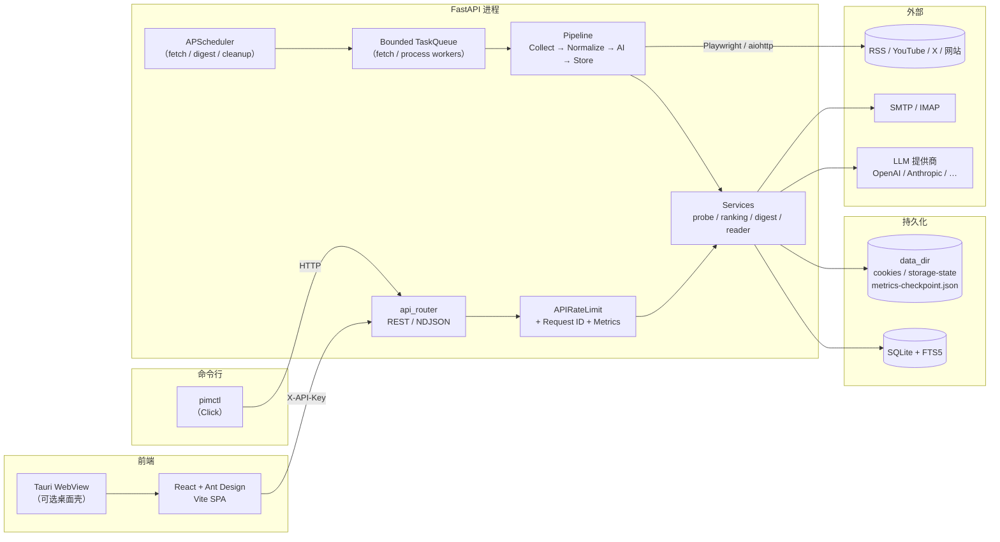
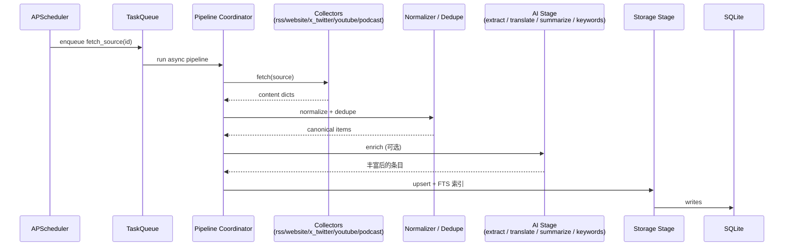
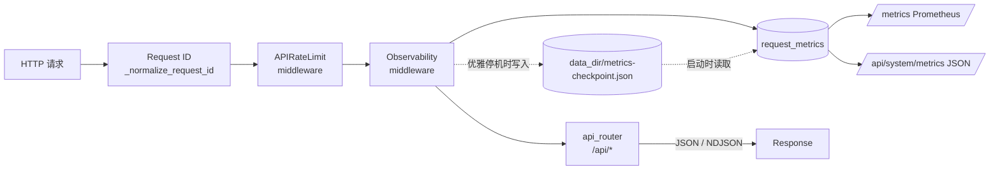
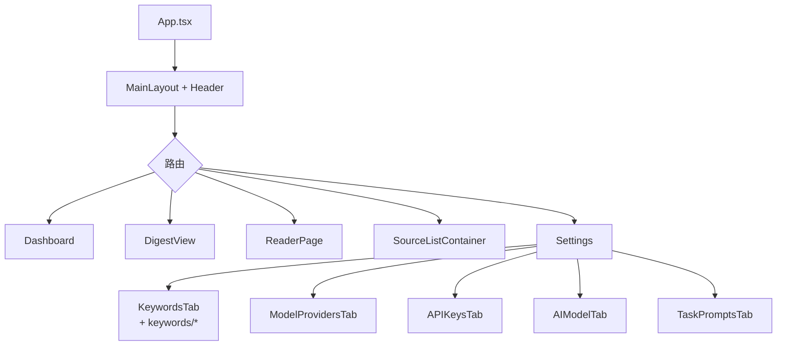

# PIM 架构总览

> 本文档描述**当前运行时代码**的架构。计划中的五模块领域划分与分阶段迁移见
> [`MODULE_REFACTOR_PLAN.md`](./MODULE_REFACTOR_PLAN.md) 与 [`MODULE_BOUNDARIES.md`](./MODULE_BOUNDARIES.md)。
>
> 具体实现细节（配置、部署、CLI）请参考 `README.md`、`docs/LOCAL_RUN.md`、
> `docs/VPS_DEPLOY.md`、`docs/CLI_SPEC.md`。

## 1. 系统分层

PIM 是一个本地优先的单体应用：一个 FastAPI 后端 + 一个 React/Tauri 前端

- 一个 Python CLI（`pimctl`），全部共享同一份 SQLite 数据库。




- **前端**：纯 SPA，所有 API 调用都带 `X-API-Key`。Tauri 只是一个可选外壳，加载同一个 SPA。
- **CLI**：`pimctl` 是一个独立的 Click 包（`cli/pimctl/`），通过 HTTP 访问后端，不直接读数据库。
- **后端**：一个 FastAPI 进程同时承载 HTTP、调度器和有界任务队列；状态完全保存在 SQLite + `data_dir` 的文件里。

## 2. 抓取与处理流水线




关键要点：

- **拉取策略注册表**：`app/services/probe_strategies/registry.py` 以 `{source_type: Strategy}` 形式注册 RSS / website / X / YouTube / podcast，
新增类型只需新增策略类并在注册表里登记，`ProbeService` 不再依赖 mixin 继承。
- **X/Twitter 多策略回退**：`XCollector` 按 `graphql → rsshub → nitter → api` 顺序尝试，失败时逐步降级；纯文本/URL 工具在 `x_twitter_text.py`，
数据格式化在 `x_twitter_formatters.py`。
- **Website 采集分层**：`WebsiteCollector` 只做 fetch / hydrate 状态机；URL/Cookie 判定在 `website_helpers.py`，HTML 解析在 `website_parser.py`，
后者纯函数、直接 fixture 可测。
- **小时简报**：`app/services/hourly_digest/` 把原来 850+ 行的单文件拆成 `text_utils / selection / synthesis / repository`，`app/tasks/hourly_digest_tasks.py`
只作编排。

## 3. HTTP 请求 / 可观测性




- 所有计数器都通过 `app/utils/metrics.py` 的三个单例采集：`request_metrics`、`source_metrics`、`task_queue_metrics`。
- **指标持久化**：优雅停机时把计数器序列化到 `data_dir/metrics-checkpoint.json`，启动时还原，避免 `rate()` 在每次重启后归零。
- `docs/API_GUIDE.md` 提供了 `rate()` 推荐查询和 Prometheus/Grafana 集成说明。

## 4. 关键服务边界


| 组件                     | 所在模块                              | 职责                                         |
| ---------------------- | --------------------------------- | ------------------------------------------ |
| `ProbeService`         | `app/services/probe_service.py`   | 通过注册表分派到具体策略，检测信源可达性与推荐抓取方式                |
| `Pipeline Coordinator` | `app/pipeline/coordinator.py`     | 串起 Collect → Normalize → AI → Store 的异步状态机 |
| `RankingService`       | `app/services/ranking_service.py` | 日报排序、时间衰减、去重                               |
| `DigestService`        | `app/services/digest_service.py`  | 日报持久化与接口                                   |
| `Hourly Digest`        | `app/services/hourly_digest/*.py` | 小时级简报候选选择 / LLM 合成 / 存储                    |
| `Reader`               | `app/services/reader/*.py`        | 正文拉取 / 标题翻译 / NDJSON 流式翻译                  |
| `SystemSettings`       | `app/services/system_settings.py` | 运行时开关和限额（rate limits、并发、翻译等）               |
| `TaskQueue`            | `app/tasks/task_queue.py`         | 基于 asyncio 的有界工作队列，防止抓取任务打爆进程              |
| `BrowserPool`          | `app/utils/browser.py`            | 共享的 Playwright/Chromium 生命周期管理             |


## 5. 前端结构（摘要）




- 原 `KeywordsTab.tsx` 已拆成 `components/Settings/keywords/{KeywordFormModal,KeywordBulkBar,keywordConstants,keywordHelpers}` 等，
`KeywordsTab.tsx` 本身退化为 ~430 行的编排器。
- `useDashboard` / `useReader` hooks 封装了首页和 Reader 的数据请求与流式翻译。

## 6. 数据目录（`data_dir`）

```
data_dir/
├── pim.db                    SQLite 主库（含 FTS5）
├── runtime-secrets.json      PIM API Key、JWT 种子（由 pim setup 写入）
├── metrics-checkpoint.json   请求/抓取/队列计数器（优雅停机写入）
├── cookies/                  按信源域名组织的 cookie 导入结果
└── storage-state/            Playwright storage_state 导出（登录态）
```

## 7. CLI 入口矩阵

PIM 有两个互补的 CLI，职责严格分开：

| 入口 | 位置 | 面向 | 依赖 | 典型命令 |
| --- | --- | --- | --- | --- |
| `./pim` | 仓库根目录的 `pim` Python 脚本 | **宿主机运维**（macOS 本地 / VPS） | 只依赖系统 Python 3.11+ 和 `backend/.venv` | `./pim setup`、`./pim start [--prod]`、`./pim install-service`、`./pim status`、`./pim backup`、`./pim rollback <rev>`、`./pim logs`、`./pim cleanup`、`./pim bootstrap-url` |
| `pimctl` | `cli/pimctl/`（Click 包） | **脚本 / Agent / 远程调用** | 通过 HTTP+`X-API-Key` 访问后端，不直接读数据库 | `pimctl auth login`、`pimctl system health`、`pimctl sources …`、`pimctl contents search …`、`pimctl settings …` |

- `./pim` 只做**生命周期**：venv、依赖安装、LaunchAgent、启停、日志轮转、SQLite 备份/回滚。它是可选的，目的是让个人用户在 macOS 上 "一键跑"。
- `pimctl` 只做**业务 API 的封装**：每条命令都对应一条或少数几条后端 API 调用，统一支持 `--json` 信封，专为无头调用和 Agent 设计。
- 二者的唯一交集在 `./pim bootstrap-url` → `pimctl auth login`：前者吐出一个一次性引导 URL，`pimctl` 或浏览器消费后完成 profile 配置。

详细命令树见：

- 设计规范：`docs/CLI_SPEC.md`
- `pimctl` 参考手册：`docs/PIMCTL_REFERENCE.md`
- macOS lifecycle 命令源码：仓库根目录的 `pim`

## 8. 依赖与锁定

后端的 Python 依赖采用单一源：

```
backend/pyproject.toml       ← 唯一手工维护的依赖清单
backend/uv.lock              ← `uv lock` 生成，提交到仓库
backend/requirements.txt     ← `uv export --no-hashes --no-dev ...` 导出，用于 pip / ./pim setup
backend/requirements-dev.txt ← 含 pytest/ruff，便于只装开发工具的场景
```

CI 会在每次构建时重新运行 `uv export` 并 `diff` 生成结果与提交的 `requirements.txt` 是否一致，
保证三个文件永远一致。新增或升级依赖的正确流程：

1. 改 `pyproject.toml` 里的 `dependencies` 或 `[project.optional-dependencies].dev`。
2. `cd backend && uv lock`。
3. `uv export --no-hashes --no-dev --no-emit-project --format requirements.txt -o requirements.txt`。
4. 必要时同步生成 `requirements-dev.txt`（`--extra dev`）。
5. 一起提交。

前端保持 `frontend/package.json` + `package-lock.json` 的 npm 标准做法。

## 9. 运行时不变量

- 每个抓取任务都经过 SSRF 过滤（`app/utils/ssrf.py`），内网地址一律拒绝。
- 所有 `except Exception:` 都必须配 `# noqa: BLE001` 或改为更窄异常——仓库级 ruff 规则强制。
- 持久化层只通过 `app/services/*` 暴露；`app/api/*` 不直接写 SQLAlchemy 查询之外的业务逻辑。

## 10. 进一步阅读

- 审计与整改记录（历史）：`docs/reviews/archive/`
- 小时简报 / Digest 设计：`docs/reviews/archive/superpowers-specs/2026-04-01-phase2-3-design.md`
- API 参考与 `rate()` 查询样例：`docs/API_GUIDE.md`
- 部署与运维：`docs/VPS_DEPLOY.md`、`docs/LOCAL_RUN.md`

