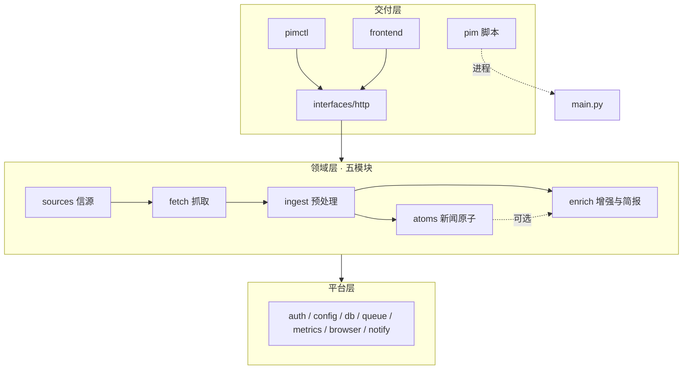
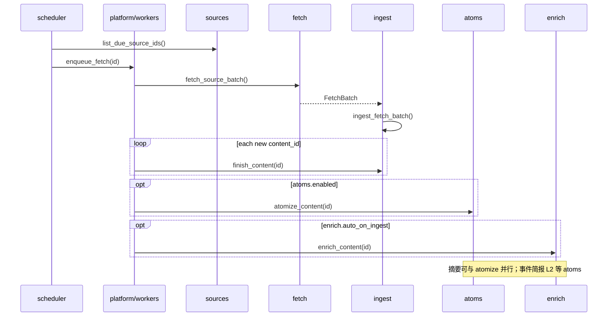

# PIM 模块化重构方案

> **状态：** 草案（设计共识文档）  
> **日期：** 2026-05-19  
> **关联：** [ARCHITECTURE.md](./ARCHITECTURE.md)、[ADR-001-local-monolith.md](./ADR-001-local-monolith.md)、[audit/00-summary.md](../audit/00-summary.md)

本文档汇总模块化重构的完整方案，便于按 **五个领域模块** 分阶段实施、单独优化与排障。CLI / HTTP / 前端属于 **交付层**，不列为第六个业务模块。

---

## 1. 目标

| 目标 | 说明 |
|------|------|
| **边界清晰** | 信源、抓取、预处理、原子化、增强五条链路职责单一、依赖单向 |
| **可独立优化** | 例如只升级 `fetch` 的 Playwright 策略，或只改 `atoms` 的 schema，不影响其它包 |
| **运维友好** | 日志/指标/文档按模块标注；README 与排障表能映射到目录 |
| **行为兼容** | 重构以搬迁与收口为主，默认配置下用户可见行为与现网一致 |
| **为「新闻原子」预留** | `atoms` 作为 ingest 之后、enrich 可选消费的扩展点 |

### 非目标

- 拆成多进程、引入 Redis/Kafka
- 更换数据库或修改对外 API 路径（`/api/*` 保持不变）
- 一次性大爆炸式重写

---

## 2. 总体分层

```
personal-info-monitor/
├── pim                          # 运维：进程/venv/备份/LaunchAgent（交付·宿主机）
├── cli/pimctl/                  # 业务 CLI：HTTP 客户端（交付）
├── frontend/                    # Web UI / Tauri（交付）
│
└── backend/app/
    ├── interfaces/              # HTTP 路由、NDJSON、聚合读 API
    ├── domains/                 # ★ 五个业务模块
    │   ├── sources/
    │   ├── fetch/
    │   ├── ingest/
    │   ├── atoms/
    │   └── enrich/
    ├── platform/                # 横切运行时（认证、队列、指标、浏览器池…）
    ├── models/                  # 共享 ORM（可按域分子包，共库 SQLite）
    ├── schemas/                 # 共享 Pydantic DTO
    ├── tasks/                   # 薄编排：enqueue → domains
    ├── main.py                  # FastAPI 入口
    └── scheduler.py             # 注册 cron → tasks
```



### 依赖规则（强制）

| 允许 | 禁止 |
|------|------|
| `interfaces` → `domains`, `platform` | `domains.*` → `interfaces` |
| `domains.fetch` → `domains.sources`（读上下文） | `domains.fetch` → `domains.enrich` / `atoms` |
| `domains.ingest` → `domains.fetch`（仅 DTO） | `domains.ingest` → LLM |
| `domains.atoms` → `domains.ingest`（读 Content） | `domains.atoms` 阻塞 ingest 提交 |
| `domains.enrich` → `ports` 读 atoms（可选） | `enrich` 直接调 collector |
| `domains.*` → `platform` | `platform` → `domains`（除 models） |
| `cli/pimctl` 仅 HTTP | `pimctl` import `app.domains` |

CI 建议：`import-linter` 或脚本校验 `domains/fetch` 目录下无 `Summarizer`/`Translator`/`atoms` import。

---

## 3. 五模块职责

### 3.1 `domains.sources` — 信源维护与管理

**负责**

- Source CRUD、导入导出、URL 规范化去重、配额
- Probe（可达性、推荐抓取方式、`metadata_` 写入）
- **调度唯一真相源**：`effective_interval_minutes`、`list_due_source_ids`（合并现 `fetch_tasks` + `MonitorService`）
- 给 API 的 `SourceView` 序列化、抓取/探测状态展示

**不负责**

- HTTP 拉取、HTML 解析、写 `contents` 表、LLM

**对外入口（示例）**

```python
# domains/sources/service.py
async def create_source(db, data) -> Source: ...
async def update_source(db, id, data) -> Source: ...

# domains/sources/scheduling.py
def list_due_source_ids(db, *, now: datetime) -> list[str]: ...

# domains/sources/probe/service.py
async def probe_url(url: str, type: str) -> ProbeResult: ...
```

**迁移来源**

| 现状 | 目标 |
|------|------|
| `api/sources/query.py`, `mutation.py` | `interfaces` 薄路由 → `sources.service` |
| `api/sources/_helpers.py`（probe/序列化/配额） | 拆到 `sources/status.py`, `probe/worker.py`, `repository.py` |
| `services/probe_service.py`, `probe_strategies/*` | `sources/probe/` |
| `services/monitor_service.py` | `sources/scheduling.py` |

---

### 3.2 `domains.fetch` — 抓取

**负责**

- 按信源类型从外部拉取 **原始条目**（`RawItem`）
- 认证：Cookie 刷新、浏览器会话、多 URL
- 抓取锁、域名限速、抓取结果回写 `Source` 状态（经 `sources.status`）

**不负责**

- 语义去重、建 `Content`、FTS、关键词、质量分、LLM、atoms

**对外入口**

```python
@dataclass(frozen=True)
class FetchContext:
    source_id: str
    source_type: str
    primary_url: str
    extra_urls: tuple[str, ...]
    auth_config_id: str | None
    metadata: Mapping[str, Any]

@dataclass
class FetchBatch:
    source_id: str
    items: list[RawItem]
    warnings: list[FetchWarning]

async def fetch_source_batch(db, ctx: FetchContext, *, manual: bool) -> FetchBatch: ...
```

**迁移来源**

| 现状 | 目标 |
|------|------|
| `collectors/*` | `domains/fetch/collectors/` |
| `pipeline/collector_stage.py` | `domains/fetch/collector_stage.py` |
| `tasks/fetch_auth_helpers.py`, `fetch_orchestrator.py` | `domains/fetch/auth/`, `outcome.py` |
| `pipeline/coordinator.py`（前半） | `fetch/coordinator.py`（仅产出 `FetchBatch`） |
| `pipeline/ai_stage.py` | **删除**（遗留） |

**重要改造：** collector 不再 mutate ORM `source.url`；临时 URL 通过 `FetchContext` 传入。

---

### 3.3 `domains.ingest` — 抓取后预处理

**负责**

- 规范化、新鲜度、URL/语义去重、`external_id` 冲突
- HTML 清洗、extractor（无 LLM）、占位摘要（截断）
- 持久化 `Content`、FTS 索引、`last_content_id`
- **统一关键词**：信源级 `use_keyword_filter` + `keyword_matches`
- **质量与评分**：`content_quality`、`baseline scoring`
- Cookie 全文补全（非 LLM，属 enrich 前的正文完善）

**不负责**

- 对外 HTTP 抓取、LLM 摘要/翻译、日报文案、atoms schema

**对外入口**

```python
async def ingest_fetch_batch(db, batch: FetchBatch, *, manual: bool) -> IngestResult: ...

async def finish_content(content_id: str) -> None:
    """原 process_new_content：cookie 全文 + keywords + quality + scoring。"""
```

**迁移来源**

| 现状 | 目标 |
|------|------|
| `pipeline/normalizer_stage.py`, `dedupe.py`, `storage_stage.py` | `ingest/normalizer.py`, `dedupe.py`, `storage.py` |
| `pipeline/coordinator.py`（后半） | `ingest/coordinator.py` |
| `tasks/process_tasks.py`（非 LLM 部分） | `ingest/finish_content.py` |
| `services/content_quality_service.py`, `scoring_service.py` | `ingest/quality.py`, `scoring.py` |
| `processors/extractor.py`（无 LLM） | `ingest/extractor.py` 或保留 `platform` 共用 |

---

### 3.4 `domains.atoms` — 新闻原子（结构化，可分期上线）

**负责**

- 将已入库 `Content` 结构化为「新闻原子」及关联表（事件、实体、关系）
- Schema 版本、幂等写入、按 `content_id` 重建
- 规则抽取 + 可选 LLM 抽取（调用 `platform.llm`，实现放在 `atoms/extractors/`）

**不负责**

- 抓取、ingest 去重、用户可读摘要、邮件推送

**与 enrich 的关系（共识）**

| 层级 | 策略 |
|------|------|
| **架构** | atoms 是 enrich 的 **可选上游**，不是全局前置条件 |
| **L0** | enrich 不读 atoms（如 Reader 流式翻译） |
| **L1** | 有 atoms 则用，无则回退 `Content`（日报选稿） |
| **L2** | 某功能开启时必须有 atoms（如「事件时间线简报」），否则排队 `atomize` 或明确报错 |

**对外入口**

```python
async def atomize_content(content_id: str) -> AtomizeResult: ...
async def try_load_atoms(content_id: str) -> AtomBundle | None: ...  # 供 enrich 端口
```

**迁移来源：** 新建；ingest 完成后 `enqueue_atomize`（`atoms.enabled` 默认 `false` 直至 Phase 6）。

---

### 3.5 `domains.enrich` — 摘要、翻译、简报

**负责**

- 单条：LLM 摘要/翻译、手动 `reprocess`
- Reader 流式翻译
- 日报 / 小时报、排序、邮件内容与触发
- 关键词告警邮件（内容侧）

**不负责**

- 信源 CRUD、外部抓取、ingest 去重

**配置（修复现 dead config）**

```env
# 替代仅打印横幅的 AI_PROCESSING_ENABLED
ENRICH_AUTO_ON_INGEST=false          # 入库后是否自动摘要/翻译（默认 false，与现网一致）
ENRICH_SUMMARY_ENABLED=true
ENRICH_TRANSLATE_ENABLED=true
```

**对外入口**

```python
async def enrich_content(content_id, *, summary: bool, translate: bool) -> None: ...
async def reprocess_content(content_id, *, regenerate_summary, retranslate) -> None: ...
# digest/hourly/email → enrich/digest/, enrich/hourly/, enrich/notifications/
```

**迁移来源**

| 现状 | 目标 |
|------|------|
| `processors/summarizer.py`, `translator.py`, `content_processor.py`（LLM 路径） | `enrich/content/` |
| `tasks/process_tasks.py`（reprocess） | `enrich/content/jobs.py` |
| `services/reader/*` | `enrich/reader/` |
| `services/digest_service.py`, `ranking_service.py` | `enrich/digest/` |
| `services/hourly_digest/*`, `tasks/hourly_digest_tasks.py` | `enrich/hourly/` |
| `tasks/email_tasks.py`（业务内容） | `enrich/notifications/` |
| `ai/provider.py` | `platform/llm/`（domains 共用） |

**atoms 消费端口（避免硬依赖）**

```python
# domains/enrich/ports/atoms.py
class AtomReader(Protocol):
    async def try_load(self, content_id: str) -> AtomBundle | None: ...

# 启动时注册：domains.atoms.repository 实现该协议
```

---

## 4. 平台层 `platform/`

不属于五模块，但被各领域调用：

| 子包 | 职责 | 现状 |
|------|------|------|
| `platform/auth` | API Key、`/local-token` | `auth.py` |
| `platform/config` | Settings、feature flags | `config.py`, `features.py` |
| `platform/persistence` | DB session、Alembic 钩子 | `database.py`, `migrations.py` |
| `platform/workers` | `TaskQueue`、worker 指标 | `tasks/task_queue.py` |
| `platform/scheduling` | 与 `scheduler.py` 桥接 | `scheduler.py` 保留根目录 |
| `platform/observability` | metrics、request id、tracing | `utils/metrics.py`, `middleware/` |
| `platform/security` | SSRF、encryption | `utils/ssrf.py`, `encryption.py` |
| `platform/browser` | Playwright 池 | `utils/browser.py`, `playwright_*` |
| `platform/locks` | fetch_lock、runtime_lock | `runtime_lock_service` |
| `platform/llm` | provider、semaphore | `ai/provider.py`, `background.py` |
| `platform/notifications` | SMTP 发送器 | `email_tasks` 传输部分 |
| `platform/health` | Doctor 聚合 | `doctor_service.py` |
| `platform/export` | Markdown 导出、FTS rebuild | `exporters/`, `tasks/maintenance.py` |

---

## 5. 交付层 `interfaces/`

| 入口 | 位置 | 说明 |
|------|------|------|
| HTTP API | `interfaces/http/`（由原 `api/` 迁入或别名） | 只做校验、鉴权、调用 `domains.*` |
| pimctl | `cli/pimctl/` | **保持独立包**，仅 HTTP |
| ./pim | 仓库根 | 运维脚本，不 import domains |
| 前端 | `frontend/` | 不变；按模块更新「开发指南」章节即可 |

**跨域 API 归属（不新增第六模块）**

| 路由组 | 调用 |
|--------|------|
| `/api/sources` | `sources` |
| `/api/contents` | `ingest` 读 + `enrich` 写（reprocess） |
| `/api/digest` | `enrich.digest` / `enrich.hourly` |
| `/api/configs` | 门面：`sources`（凭据）+ `fetch`（浏览器）+ `enrich.llm`（模型 Key） |
| `/api/dashboard` | `interfaces/read_models/dashboard`（只读聚合） |
| `/api/keywords` | `ingest`（规则）+ `enrich`（告警） |
| `/api/atoms`（未来） | `atoms` |

---

## 6. 运行时任务链



**任务队列命名**

| 现名 | 新名 | 模块 |
|------|------|------|
| `enqueue_fetch` | 不变 | fetch |
| `enqueue_process` | `enqueue_ingest_finish` | ingest |
| — | `enqueue_atomize` | atoms |
| — | `enqueue_enrich` | enrich |
| `process_content` | `enqueue_enrich_reprocess` | enrich |

---

## 7. 分阶段实施计划

每个 Phase 独立 PR，**pytest + 前端 build 全绿** 再合并下一 Phase。

| Phase | 状态 | 内容 | 用户可见变化 |
|-------|------|------|----------------|
| **0** | ✅ 已合并 | `MODULE_REFACTOR_PLAN.md`、ADR-005、import 门禁、删除 `pipeline/ai_stage` | 无 |
| **1** | ✅ 已合并 | `domains/sources`：scheduling 单源、瘦身 `_helpers` | 无 |
| **2** | ✅ 已合并 | `domains/fetch`：迁入 collectors、产出 `FetchBatch` | 无 |
| **3** | ✅ 已合并 | `domains/ingest`：迁入 pipeline 后半、`finish_content` | 无 |
| **4** | ✅ 已合并 | `domains/enrich`：迁入 LLM/reader/digest/email；新增 `ENRICH_*` 配置族 | 配置项细化；`AI_PROCESSING_ENABLED` 保留为 master kill switch |
| **5** | ✅ 已合并 | `platform/` 收口；`interfaces/http` 薄化；`tasks/` 仅编排；`app/api → app/interfaces/http` 通过 `sys.modules` 别名共存 | 无 |
| **6** | ✅ 已合并 | `domains/atoms` 骨架 + 表迁移 + best-effort 旁路；`ATOMS_ENABLED` 开关，默认 off | 无（直至显式开启） |
| **7** | ✅ 已合并 | 清扫 `process_new_content`/`_dispatch_keyword_alerts`/`enqueue_process`/`_build_raw_content_objects`/`_effective_due_interval_minutes` 等历史别名；删除 `configs_common` facade；裁剪 `tasks/processors/services/__init__.py` 的再导出 | 无 |
| **post-Phase-7 audit** | ✅ 已合并 | 仓库整体复盘：删除 22 个无 caller 的 re-export shim（`app.collectors.{podcast,website_helpers,x_twitter_formatters}` / `app.data.source_types` / `app.exporters.markdown_exporter` / `app.services.{hourly_digest,reader,runtime_lock_service,system_settings}` / `app.tasks.{email_tasks,fetch_orchestrator,hourly_digest_tasks}` / `app.utils.{ssrf,tracing}`）+ 8 个 `tests/manual/tmp_*.py` 临时调试脚本；归档 `audit/` 历史快照与 2026-05 的 plan；对齐 README/ARCHITECTURE/MODULE_BOUNDARIES/ADR-005 等运维文档与最新代码事实 | 无 |

### Phase 7 与后续兼容性

- 仍保留为 patch-target shim：`app.config` / `app.database` / `app.auth` / `app.background` / `app.collectors.{base,rss,youtube,x_twitter,website,...}` / `app.utils.{logger,metrics,encryption,browser}` / `app.processors.content_processor`。这些 shim 有真实测试 patch target 或运行时 caller，不能轻易删除。
- `app.api → app.interfaces.http` 通过 `sys.modules` 别名共存。`app/main.py` 仍走 `from app.api import api_router`；如要删除别名，需先在 `main.py` 与所有测试中改 import 路径。
- 环境变量：`AI_PROCESSING_ENABLED` 保留为 master kill switch（与 `ENRICH_*` 同时检查）；并未按原计划改为 mapping 到 `ENRICH_AUTO_ON_INGEST`，新部署优先使用 `ENRICH_*` 系列做细粒度控制。

---

## 8. 现状 → 目标路径对照表（速查）

<details>
<summary>点击展开完整映射</summary>

| 现状路径 | 目标 |
|----------|------|
| `app/api/sources/*` | `interfaces/http/sources/*` → `domains/sources` |
| `app/api/contents*.py` | `interfaces/http/contents/*` → `ingest` + `enrich` |
| `app/api/digest.py` | `interfaces/http/digest` → `enrich` |
| `app/api/configs*.py` | `interfaces/http/configs` → 多 domain 门面 |
| `app/api/dashboard.py` | `interfaces/http/dashboard` → read_models |
| `app/collectors/*` | `domains/fetch/collectors/` |
| `app/pipeline/*` | 拆分 → `fetch` + `ingest`；删除 `ai_stage` |
| `app/processors/*` | `ingest/extractor` + `enrich/content/*` |
| `app/tasks/fetch_tasks.py` | `tasks/fetch_jobs.py` → `fetch` + `sources.scheduling` |
| `app/tasks/process_tasks.py` | 拆分 → `ingest/finish` + `enrich/jobs` |
| `app/tasks/email_tasks.py` | `enrich/notifications` + `platform/notifications` |
| `app/services/probe_*` | `domains/sources/probe/` |
| `app/services/digest_service.py` | `domains/enrich/digest/` |
| `app/services/hourly_digest/*` | `domains/enrich/hourly/` |
| `app/services/reader/*` | `domains/enrich/reader/` |
| `app/services/content_quality_service.py` | `domains/ingest/quality.py` |
| `app/services/scoring_service.py` | `domains/ingest/scoring.py` |
| `app/services/monitor_service.py` | `domains/sources/scheduling.py` |
| `app/middleware/*` | `platform/observability/` |
| `app/utils/browser.py` | `platform/browser/` |
| `app/ai/provider.py` | `platform/llm/` |

</details>

---

## 9. 测试策略

| 层级 | 范围 |
|------|------|
| **单元** | 每 domain 内纯函数；`sources/scheduling`、`ingest/dedupe`、`atoms/schema` |
| **契约** | `FetchBatch` JSON fixture → `IngestResult`；`AtomBundle` → enrich L1 |
| **集成** | mock collector → ingest 写库 → 可选 atomize → enrich mock LLM |
| **E2E** | 现有 Playwright + API 测试不改 URL |
| **覆盖率** | CI 按 `domains/*` 分目录报告；`ingest`、`fetch` 优先 ≥70% |

测试目录建议（逐步迁移）：

```
backend/tests/
├── domains/
│   ├── sources/
│   ├── fetch/
│   ├── ingest/
│   ├── atoms/
│   └── enrich/
├── interfaces/
└── platform/
```

---

## 10. 可观测性与运维

### 10.1 日志

结构化字段统一增加 `domain`：

```text
domain=fetch source_id=... event=collector_done items=12
domain=ingest content_id=... event=finish_content
domain=atoms content_id=... event=atomize_failed reason=...
domain=enrich content_id=... event=translate_stream
```

`./pim logs` 无需改命令；文档说明可用 `grep 'domain=fetch'` 过滤。

### 10.2 指标（分期）

| 指标 | 模块 |
|------|------|
| `pim_fetch_*` | fetch |
| `pim_ingest_*` | ingest |
| `pim_atoms_*` | atoms |
| `pim_enrich_*` | enrich |
| `pim_http_*` | platform/observability |

`GET /api/system/health` 增加分模块摘要（可选 Phase 5）：

```json
{
  "domains": {
    "fetch": { "queue_depth": 2, "locked_sources": 1 },
    "ingest": { "pending_finish": 0 },
    "atoms": { "enabled": false },
    "enrich": { "llm_semaphore_available": 3 }
  }
}
```

### 10.3 配置项（重构后 `.env.example` 分组）

```env
# --- sources ---
# （信源配额等多在 system_settings API）

# --- fetch ---
FETCH_CONCURRENCY=20

# --- ingest ---
# （关键词等）

# --- atoms ---
ATOMS_ENABLED=false
ATOMS_AUTO_ON_INGEST=false
ATOMS_MODE=hybrid          # rules | llm | hybrid

# --- enrich ---
ENRICH_AUTO_ON_INGEST=false
ENRICH_SUMMARY_ENABLED=true
ENRICH_TRANSLATE_ENABLED=true
# 兼容旧名（Phase 7 前）
# AI_PROCESSING_ENABLED=   # deprecated → ENRICH_AUTO_ON_INGEST
```

### 10.4 排障速查

| 现象 | 先看模块 | 命令/位置 |
|------|----------|-----------|
| 信源不抓取 | sources + fetch | `./pimctl sources list`；日志 `domain=fetch` |
| 抓取成功但无新条目 | ingest | 日志 `domain=ingest`；DB `contents` |
| 无摘要/翻译 | enrich | `ENRICH_*`；`./pimctl settings get` |
| 简报异常 | enrich.hourly | `domain=enrich`；`/api/digest` |
| 结构化/事件检索（未来） | atoms | `ATOMS_ENABLED` |

---

## 11. 文档与 README 更新计划（Phase 7）

重构合并后 **一次性** 更新下列文档，避免半成品误导。

### 11.1 新建

| 文档 | 内容 |
|------|------|
| `docs/MODULE_REFACTOR_PLAN.md` | 本文 |
| `docs/MODULE_BOUNDARIES.md` | 五模块 + platform + 交付 一页纸；依赖图 |
| `docs/ADR-005-module-boundaries.md` | ADR 记录决策 |
| `backend/README.md` § 模块开发 | 如何在单个 domain 下加功能、跑测试 |

### 11.2 重写/大改

| 文档 | 变更要点 |
|------|----------|
| **`README.md`** | 增加「架构一览」小节（五模块表 + 链接）；配置表按 domain 分组；`AI_PROCESSING_ENABLED` → `ENRICH_*`；文档索引增加 `MODULE_BOUNDARIES.md` |
| **`docs/ARCHITECTURE.md`** | 数据流图改为五模块版；删除对 `pipeline/ai_stage` 的引用 |
| **`docs/API_GUIDE.md`** | 路由表标注所属 domain；metrics 按 domain |
| **`docs/AGENT_GUIDE.md`** | 工作流：抓取≠AI；atoms 可选 |
| **`docs/TROUBLESHOOTING.md`** | 按 §10.4 模块排障表 |
| **`docs/CONTRIBUTING.md`** | PR 应标明影响 domain；import 规则 |

### 11.3 README 建议新增章节（草稿结构）

```markdown
## 架构与模块

PIM 后端按五个领域模块组织，便于独立演进：

| 模块 | 目录 | 职责 |
|------|------|------|
| 信源 | `domains/sources` | 信源 CRUD、探测、调度 |
| 抓取 | `domains/fetch` | 从外部拉取原始内容 |
| 预处理 | `domains/ingest` | 清洗、去重、入库、关键词与质量分 |
| 新闻原子 | `domains/atoms` | 结构化事件/实体（可选） |
| 增强 | `domains/enrich` | 摘要、翻译、日报/小时报 |

交付入口：`interfaces/http`（API）、`cli/pimctl`（CLI）、`frontend`（UI）。  
横切能力：`platform/*`（认证、队列、指标、浏览器池）。

详见 [docs/MODULE_BOUNDARIES.md](docs/MODULE_BOUNDARIES.md)。
```

### 11.4 运维文档

| 文档 | 变更 |
|------|------|
| `docs/LOCAL_RUN.md` | 开发者按 domain 跑单测示例 |
| `docs/VPS_DEPLOY.md` | 无架构变更；补充 `domain=` 日志 |
| `docs/PIMCTL_REFERENCE.md` | 命令标注对应 API / domain |
| `docs/CLI_SPEC.md` | `./pim` vs `pimctl` 与交付层关系（保持两 CLI 分工） |

### 11.5 不必改动的用户面

- 所有 URL 路径、`./pim` / `pimctl` 命令名
- `DATA_DIR`、备份/回滚流程
- 前端路由

---

## 12. 单独优化某一模块时的检查清单

以只改 `domains/fetch` 为例：

1. **依赖：** 不新增对 `enrich` / `atoms` 的 import  
2. **测试：** 只跑 `pytest tests/domains/fetch` + 集成 `fetch→ingest` 冒烟  
3. **契约：** `FetchBatch` / `RawItem` 字段变更需同步 `ingest` 适配  
4. **文档：** `MODULE_BOUNDARIES.md` 中 fetch 小节 + CHANGELOG  
5. **运维：** 日志带 `domain=fetch`；如有新 env，更新 `.env.example` 的 fetch 段  

其它模块同理；`atoms` 与 `enrich` 之间仅通过 `AtomReader` 协议交互。

---

## 13. 成功标准（Done Definition）

- [ ] 五模块目录存在，import 门禁 CI 通过  
- [ ] 无 `pipeline` → `tasks` 反向依赖；无 `ai_stage`  
- [ ] `list_due_source_ids` 仅一处实现  
- [ ] 默认配置下行为与重构前一致（`ATOMS_ENABLED=false`，`ENRICH_AUTO_ON_INGEST=false`）  
- [ ] 全量 pytest + frontend build 通过  
- [ ] README / ARCHITECTURE / MODULE_BOUNDARIES / ADR-005 已更新  
- [ ] `./pim`、`pimctl`、VPS 部署文档无需改命令即可运维  

---

## 14. 后续可选（超出本方案）

- OpenAPI tag 与 `domains` 对齐（`/docs` 分组）  
- 按 domain 拆分的覆盖率门禁  
- atoms 表设计与 `GET /api/atoms` API 专章（另开设计 doc）  

---

## 15. 修订记录

| 日期 | 说明 |
|------|------|
| 2026-05-19 | 初稿：五模块 + platform + 交付层；atoms 可选上游；运维与 README 计划 |
